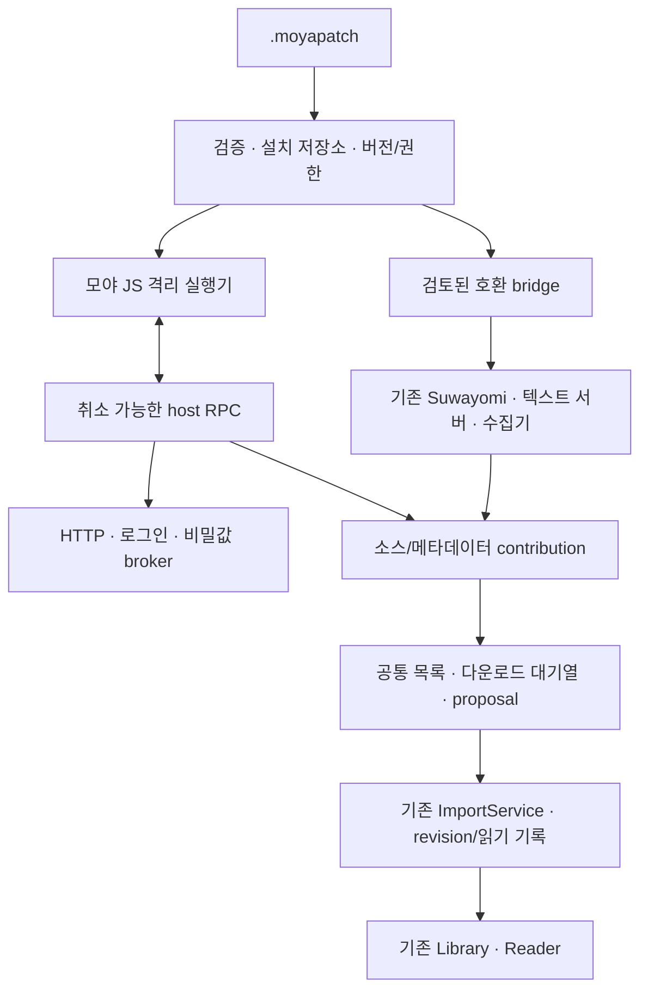

# `.moyaext` 설치형 확장 설계 검토

상태: 채택한 설계 · 단계별 구현 진행 / 2026-09-12

검토 기준: 개발 checkpoint `54e6580d`의 확장·소스 경계. 진행 중인 Web 변경은 수정하지 않았다.

2026-09-12 구현 보완: Hosted 저장/실행/설치 UI에 이어 Windows 기기 설치도 같은 manager/source 계약에
연결했다. 기기 설치 archive는 별도 IndexedDB, 실행은 앱에 포함한 Node/QuickJS 프로세스가 맡는다. 아래 표는
설계 당시 기준이며 최신 파일 위치와 검증 범위는 [개발 안내](../extensions/source-development.md)에 기록한다.

## 1. 판단

`.moyaext`를 소스·메타데이터·보조 도구의 공통 설치 파일로 사용하는 방향을 권장한다. 실제 내용은 버전이
있는 ZIP 패키지이고, 앱에서는 **확장 패키지**라고 표시한다. 기존 앱 파일을 덮어쓰는 binary patch가 아니다.
설치와 같은 방식으로 새 버전 파일을 가져와 업데이트할 수 있다. 앱 자체 업데이트와 확장 업데이트는 분리한다.

배포 형식을 통일하는 것과 실행 환경을 통일하는 것은 다르다. 새 모야용 소스는 공통 SDK로 만들고, 기존
스와요미·텍스트 서버는 호환 커넥터로 유지한다. 데스크톱에서 서버 설치 없이 사용하는 목표도 타당하지만,
이를 위해서는 앱이 관리하는 실행기를 먼저 제공해야 한다. 파일 확장자만 바꿔 기존 APK/Node 모듈이 곧바로
실행되는 것은 아니다.

첫 제품 범위는 소스와 표지·메타데이터다. 자유로운 React 교체, Reader 본문 렌더러 교체, 임의 native code
설치까지 처음부터 열지 않는다. 설치형 확장이 없어도 Library·Reader·가져온 회차·기본 TTS는 동작한다.

## 2. 현재 구현과 새로 필요한 부분

| 경계 | 확인한 구현 | 추가할 것 |
| --- | --- | --- |
| Manifest | `packages/extension-contracts/index.ts`: manifest v1, 정수 `engine.moyaApi: 1`, source descriptor v1/v2 | 별도 package envelope, runtime handshake·권한 grant |
| 확장 실행 | `src/extensions/app-extension-runtime.ts`: 정적으로 등록한 definition; manager는 sandboxed 실행 거절 | 설치 저장소, 격리 실행기, RPC lifecycle |
| 외부 소스 | `AppExternalSourceRegistry`가 built-in과 plugin contribution을 병합하고 broker를 호출 | 설치형 contribution을 기존 port로 연결 |
| 스와요미 | `moya.external.suwayomi.sources`가 기존 서버를 호출 | 기존 연결 보존, 장기적으로 관리형 호환 엔진 |
| 텍스트 | `moya.external.text-server.sources`, 독립 서버 ABI 1과 trusted factory 주입 | ABI wrapper와 모야용 소스 SDK; 임의 Node import는 허용하지 않음 |
| 표지·metadata | trusted enrichment provider → collector broker → Hosted/desktop 수집기 | 기존 수집기는 유지하고 새 provider부터 공통 runtime에 연결 |
| Desktop | `src-tauri/src/metadata_collector.rs`와 bundle resources에 수집기 실행 경계가 있음 | 범용 확장 실행기·설치 영속화·플랫폼별 패키징은 아직 없음 |
| 설정 공유 | `SelfHostIntegrationSettingsV1`에 enablement와 비밀값 없는 연결 정보 | 실행 대상별 설치 상태·권한·버전 관리; 코드/secret과 분리 |

현재 source/enrichment 계약, 다운로드·import coordinator, identity, 읽음/읽기 위치 처리는 재사용한다.
기존 trusted TypeScript 정의를 외부에서 `import()`하는 방식으로 동적 설치를 흉내 내지 않는다.

## 3. 사용자 흐름과 실행 위치

설정의 기존 확장 관리에 **파일로 설치**를 추가한다. `.moyaext` 선택 → 이름·제공 기능·게시자·필요한 연결
확인 → 설치 순서다. 설치된 소스는 소스 화면에, 메타데이터 기능은 수집기 선택에 나타난다. 사용자가 소스,
익스텐션, 플러그인 세 종류의 설치 화면을 따로 이해할 필요가 없도록 한다.

| 환경 | 패키지 저장/실행 목표 | 제약과 UX |
| --- | --- | --- |
| Desktop 로컬 | 기기 저장소 + 앱에 포함된 확장 실행기 | 모야용 HTTP 소스는 설치 후 로그인 등 필요한 설정만 하면 사용. Node/Python 수동 설치를 요구하지 않음 |
| Self-host 웹·연결 앱 | 인증된 서버 설치 API + 서버 확장 실행기 | 설치할 서버를 명확히 표시. 서버에 설치하면 다른 연결 기기에서도 inventory가 보임 |
| 정적 Web/PWA | 향후 브라우저 지원 패키지만 로컬 격리 실행 | CORS·쿠키·브라우저 제한은 패키지로 없어지지 않음. 현재 Web profile은 서버 소스를 제한하므로 별도 범위 |
| Android 앱 | 같은 계약 + 별도 검증된 native 실행 adapter | desktop helper를 그대로 실행한다고 가정하지 않음. 지원 전에는 연결 서버 경로만 제공 |

서버에 연결된 desktop에서 로컬과 서버 양쪽 설치가 가능한 경우 기본값은 현재 소스 실행 대상이다. 설치창에
`이 기기` 또는 서버 이름을 표시하고, 임의로 다른 대상으로 전송·실행하지 않는다. 실행기 미지원은 설치 성공과
구분하여 `이 환경에서 지원하지 않음`, 필수 연결 부재는 `연결 필요`로 표시한다. 기존 권한 내 업데이트나
매번 앱을 열 때는 같은 질문을 반복하지 않는다.

처음 확장 플랫폼을 도입할 때는 앱/서버 업데이트가 한 번 필요하다. 이후 해당 API 범위의 모야용 소스 변경은
패키지만 업데이트한다. 별도 인증 서비스·브라우저 로그인·외부 서버가 필요한 확장은 그 연결을 여전히 필요로
한다. 패키지가 인증이나 사이트의 접근 조건까지 자동 해결한다고 약속하지 않는다.

## 4. 패키지 형식 초안

한 파일은 하나의 게시자와 확장 ID를 가지며 여러 contribution을 제공할 수 있다. 서로 무관한 여러 확장을
묶어 설치하는 pack은 v1에서 제외한다. npm 설치나 설치 후 script 실행도 하지 않는다.

```text
example-source.moyapatch          # ZIP; 파일명은 identity가 아님
  manifest.json                 # package + 현재 extension descriptor
  integrity.json                # payload 파일별 SHA-256/크기
  signatures/publisher.json      # 선택적 게시자 서명
  dist/main.js                  # bundle된 JS source; 외부 import 없음
  assets/icon.png
  LICENSE
  THIRD_PARTY_NOTICES.md
```

아래는 설계 예시다. 현재 validator가 받아들이는 설치 파일이 아니며, P0에서 스키마를 확정한다.

```json
{
  "packageFormat": "moya.extension.package",
  "packageVersion": 1,
  "extension": {
    "manifestVersion": 1,
    "id": "org.example.catalog",
    "name": "예제 소스",
    "version": "1.0.0",
    "engine": { "moyaApi": 1 },
    "permissions": ["external.source.list", "external.source.download"],
    "contributes": {
      "externalSources": [{
        "schemaVersion": 2,
        "id": "org.example.catalog.source",
        "title": "예제 소스",
        "kind": "catalog",
        "runtimes": ["tauri-native", "self-host-gateway"],
        "capabilities": ["browse", "search", "work-details", "release-list", "release-download", "document-content"],
        "seriesProfile": { "kind": "document_series", "format": "txt", "encoding": "utf-8", "chapterSplitMode": "single" }
      }]
    }
  },
  "execution": { "kind": "moya-js", "apiVersion": 1, "entry": "dist/main.js" },
  "requestedAccess": { "networkOrigins": ["https://catalog.example"], "storageKiB": 1024 },
  "license": "MIT"
}
```

- `packageVersion`, 기존 `manifestVersion`, 정수 `moyaApi`, 실행 RPC `apiVersion`, source/enrichment payload
  version은 역할을 분리한다. 기존 정수 API 필드에 semver 문자열을 끼워 넣지 않는다. 앱 최소 버전과 실제
  runtime capability를 설치 때 검사하고, 지원하지 않는 필수 contribution은 부분 활성화하지 않는다.
- `execution`은 모야 JS 또는 host가 알고 있는 호환 bridge를 고른다. 패키지가 shell 명령, Docker Compose,
  실행 바이너리 경로를 지정하지 못한다. bridge 선택도 권한 검증을 통과해야 한다.
- 신뢰도는 설치 기록과 검증한 서명에서 계산한다. manifest의 `trusted: true` 같은 자기 선언으로 올리지 않는다.
- 해시 목록은 manifest와 모든 payload를 포함하고 `integrity.json` 및 서명 파일 자체를 제외한다. 서명 입력은
  정규화 규칙이 고정된 integrity 문서와 format domain separator로 정한다. archive 전체 hash는 설치 receipt와
  업데이트 index에서 별도로 사용한다. 제외 파일에 임의 실행 payload를 숨길 수 없게 정확한 경로/스키마만 허용한다.
- 초기 제안 한도는 압축 10 MiB, 해제 합계 30 MiB, 256파일, manifest 64 KiB, JS entry 5 MiB다. spike에서
  필요한 값을 조정하되 스트림 해제 중에도 실제 한도를 강제한다. 패키지 한도는 회차 본문/이미지 한도와 별개다.
- 절대 경로, `..`, symlink, Windows drive/ADS/reserved name, 정규화·대소문자 충돌, 중복 entry, 암호화 ZIP,
  허용하지 않은 파일/실행물과 누락·불일치 해시를 거절한다. 내부 저장 위치는 host가 정한다.

## 5. 실행기와 host broker



권장 검증 후보는 **표준 OS 모듈을 노출하지 않는 QuickJS 계열 엔진 + host가 관리하는 별도 helper**다.
JS source bundle을 받아 host RPC만 주입하고, 런타임별 bytecode는 배포하지 않는다. Desktop과 Hosted는
같은 실행 계약을 사용한다. 정확한 엔진·binding·패키징은 P0 spike에서 선택하며 현재 도입 완료가 아니다.
QuickJS의 메모리·stack·interrupt API는 자원 제한의 근거이며, 그것만으로 전체 sandbox 안전성을 입증하지는
않는다. [QuickJS 공식 API](https://bellard.org/quickjs/quickjs.html#Memory-handling).

Browser Worker 자체는 IndexedDB·네트워크에 접근할 수 있으므로 community JS를 앱 origin Worker에 직접
실행하면 안 된다. 추후 Web은 Worker 안의 별도 interpreter/WASM realm과 검토된 bridge를 사용한다.
[Worker 제공 API](https://developer.mozilla.org/en-US/docs/Web/API/Web_Workers_API/Using_web_workers).
`node:vm`, worker thread나 별도 프로세스라는 이유만으로 권한 격리가 된 것으로 취급하지 않는다.
[Node 공식 주의사항](https://nodejs.org/api/vm.html).

Host가 소유할 경계:

- 매 RPC에 install ID·package digest·generation·connection/account·요청 ID를 결합한다. package/manifest에
  적힌 permission과 실제 grant를 함께 검사하고 disable/update/disconnect 시 이전 세대의 결과를 폐기한다.
- 네트워크는 선언된 origin과 허용된 연결을 통해서만 요청한다. redirect 매 단계, DNS/IP와 실제 접속 대상,
  응답 본문 완료까지 timeout/크기/취소를 검사한다. 사설망 접근은 선택된 서버 연결에 한정해 별도 capability로
  제공한다. 일반 사이트 소스에 localhost·내부망 전체 접근을 주지 않는다.
- 쿠키·token은 host의 account별 jar/secure store에 둔다. 응답의 인증 header를 plugin에 돌려주지 않고,
  auth flow는 별도 host 계약으로 처리한다. 필요한 요청에만 secret reference로 주입하며 다른 origin으로
  전달하지 않는다. 사용자 비밀번호·실제 서비스 키·운영 주소는 패키지에 포함하지 않는다.
- JSON은 bounded DTO로, 본문/이미지는 수명·소유권이 있는 byte stream 또는 asset handle로 전달한다. 전체
  만화를 base64 JSON으로 복제하지 않는다. `File`·함수·`AbortSignal` 객체는 wire로 보내지 않고 host가 적응한다.
- CPU/memory/실행 시간·동시 요청·임시 asset quota를 제한한다. 취소는 guest 실행, fetch body, job close와
  import 이전 단계까지 전파한다. bridge가 쓰는 외부 프로세스에도 별도 timeout/종료 경계가 필요하다.
- plugin에는 host DOM·DB·임의 filesystem·Tauri IPC·provider secret을 주지 않는다. 소스는 결과를,
  enrichment는 후보를 반환하고 host가 기존 import/proposal 검증을 수행한다. AI/TTS도 기존 provider 경계를
  통과해야 하며 외부 code에 직접 제공자 호출과 무제한 비용 발생 권한을 주지 않는다.

Desktop helper는 앱이 배포·시작·종료를 책임진다. 기존 수집기 패턴을 참고하되 무제한 프로세스 실행 port로
일반화하지 않는다. 플랫폼별 실행물 준비가 필요하다. [Tauri sidecar](https://v2.tauri.app/develop/sidecar/).
실행기는 필요할 때 시작하고 idle 상태에서 정리한다. 설치한 모든 확장을 앱 시작과 동시에 실행하지 않으며,
활성 instance 수·전체 메모리 한도도 host가 제한한다. 확장 검사/압축 해제/guest parsing은 Reader의 UI thread를
막지 않도록 처리한다. 시작 시간과 idle 메모리는 P0에서 측정해 기본 예산을 정한다.
후속 UI plugin은 선언형 form/command부터 열고, 자유 UI가 필요할 때만 앱 권한이 없는 격리 panel을 추가한다.
Tauri window/webview capability를 상속시키지 않는다. [Tauri capability 경계](https://v2.tauri.app/security/capabilities/).

## 6. 소스와 기존 확장의 호환

### 모야용 소스

JS/TS SDK의 source contribution은 목록·검색·작품 상세·회차·표지·content를 제공한다. `document_series`와
`image_series`를 같은 플랫폼에서 지원하되 출력 profile과 importer는 구분한다. 첫 text profile은 현재 검증된
UTF-8 TXT/single이며 HTML/EPUB 등은 명시적 후속 capability다. source가 임의 포맷을 TXT로 위장하지 않는다.

pagination cursor는 opaque이고 order/revision/capability는 명시적이다. “더보기만 있는 사이트”의 전체 목록
확보·영속 cache·만료 재검사·정렬·목록 페이지·대기열·읽음/안 읽음·삭제·다음 회차 다운로드는 기존 host가
맡는다. 소스 개발자가 이 UX를 다시 만들 필요가 없어야 한다. source ID를 확인하는 제품 분기는 추가하지 않는다.
다운로드 완료가 Reader 이동을 일으키지 않는 현재 규칙도 유지한다.

### 스와요미/Mihon

API 호환은 기존 Suwayomi broker를 유지하면 된다. 기존 APK/JAR **실행 호환**은 별도 문제다. 공식 서버는
APK metadata를 읽고 DEX→JAR 변환 등을 수행하며 APK/JAR 설치를 구분한다.
[Suwayomi 실행 코드](https://github.com/Suwayomi/Suwayomi-Server/blob/master/server/src/main/kotlin/suwayomi/tachidesk/manga/impl/extension/Extension.kt).

따라서 APK를 `.moyaext`로 이름만 바꿔 모야 JS 엔진에서 실행하지 않는다. 초기에는 사용 중인 서버를
그대로 연결하고, 후속으로 **앱이 관리하는 최소 APK 호환 실행기**를 제공한다. 2026-09-13 사용자 결정으로 전체
Suwayomi 내장을 제외했다. Source/Android 호환 기능과 라이브러리만 별도 worker에 넣으며 서버·DB·리더·다운로더는
포함하지 않는다. 실제 지원 범위와 설치 방법은 [소스 개발 안내](../extensions/source-development.md)를 따른다.
이 실행기가 준비되면 호환 package의
extension artifact/검증된 설치 요청을 엔진에 전달할 수 있다. endpoint preset만 등록하는 것을 APK 호환 설치
완료로 부르지 않는다. 처음부터 Kotlin/Android 호환 VM을 새로 만드는 것은 권장하지 않는다.

호환 package가 외부 APK/JAR를 포함하거나 내려받는 기능은 별도 format capability로 추가한다. upstream
package name·version·hash·게시자 identity를 고정하고 승인된 호환 엔진에만 전달한다. 모야 JS의 제한이 legacy
확장에도 적용되는 것으로 표시하지 않는다. 엔진 배포/업데이트·라이선스 고지·네트워크/프로세스 경계를 별도 검증한다.

### 텍스트 서버·메타데이터 수집기

현재 텍스트 ABI 1의 `listWorks/getWork/listReleases/getContent`와 선택적 cover는 wrapper로 매핑할 수 있다.
기존 서버와 `job-v1` 본문 공급자는 유지한다. 그러나 현재 Node 모듈이 사용하는 `fetch`, import, 파일 접근,
환경 변수는 새 sandbox API로 바꿔야 한다. **계약 호환**과 **기존 코드 무수정 실행**을 구분한다.

새 모야용 text source는 별도 텍스트 HTTP 서버 없이 desktop helper/Hosted runner에서 실행한다. 기존
수집기 구현은 먼저 bridge로 유지하고 새 metadata provider부터 SDK로 작성한다. Python/브라우저 의존
수집기를 모두 JS로 다시 작성하는 것을 패키지 플랫폼 출시 조건으로 삼지 않는다.

## 7. 설치·업데이트·복구·설정

- `선택 → 검사 → 권한/실행 대상 확인 → staging → 준비 검사 → 활성화`로 처리한다. 검증 전 코드 실행은
  하지 않는다. 동일 ID/version/hash 재설치는 no-op, 같은 version의 다른 hash는 일반 업데이트로 허용하지 않는다.
- 업데이트는 실행 대상별 잠금과 세대 교체로 처리한다. 실행 중 작업은 기존 버전에 고정해 완료시키거나
  취소 후 새 버전에서 재개한다. 준비되지 않은 새 버전이 현재 소스를 대체하지 않는다. 설치 도중 종료되면
  journal과 active pointer로 마지막 정상 버전을 선택한다.
- 수동 파일 업데이트가 첫 방식이다. 이후 명시적으로 등록한 HTTPS repository의 서명된 index에서만 갱신한다.
  ETag/기동·포커스 및 긴 간격으로 조회하고 짧은 폴링을 넣지 않는다. 자동 적용은 사용자 선택, 같은 게시자와
  호환 API, 권한 증가 없음 조건에서만 허용한다. 신규 network origin·secret scope는 추가 권한으로 취급한다.
- 서명 없는 개인 패키지는 출처 미확인으로 수동 설치할 수 있게 설계하되 동일 sandbox를 적용한다. 첫 설치에서
  publisher key 또는 package hash를 pin한다. 출처 미확인 패키지의 자동 업데이트는 금지하고, key 변경은 검증된
  회전 또는 별도 신뢰 변경으로 처리한다. `.moyaext` 해시는 무결성이지 게시자 신원의 증명이 아니다.
- package code와 package-owned 설정은 버전별로 보관한다. 새 버전의 설정 migration이 실패하면 두 가지 모두
  이전 버전으로 되돌린다. core DB migration은 plugin에 맡기지 않는다. 되돌려도 이미 import한 회차를 삭제하지 않는다.
- disable/remove 시 신규 source 작업과 subscription 실행을 중단한다. 받은 책·읽기 위치·메모는 보존하고
  link는 재설치 가능하게 남긴다. plugin cache/credential 삭제는 구분하며 진행 중 결과가 뒤늦게 commit되지 않게 한다.
- Hosted에서는 서버가 설치 파일·활성 버전·공유 설정을 소유한다. 설치 권한과 일반 source 사용 권한을 나누고
  각 요청의 사용자/connection scope를 확인한다. 코드 bytes·secret을 기존 integration-settings JSON에 넣지 않는다.
- Desktop 로컬 설치/권한은 그 기기가 소유한다. 서버 inventory 동기화만으로 다른 기기에 임의 코드가 실행되지
  않는다. 기존 화면·본문·조작 설정은 기기별로 유지한다. private package의 파일·ID·업데이트 주소를 공용 목록,
  로그·공개 예제·PR artifact로 자동 내보내지 않는다. 개인 repository와 수동 배포를 지원한다.

## 8. 기존 작품·연결을 보존하는 전환

현재 `externalDocumentCollectionId`/release ID는 connector와 account connection 및 원격 ID에 의존한다.
텍스트 서버의 connection ID에는 instance/data namespace/account가 들어간다. package version/hash나 실행
위치 변경을 이 identity에 섞으면 기존 책과 분리되므로 금지한다.

package 업데이트에 따른 parser/metadata cache 무효화 키는 영구 작품 identity와 분리한다. 새 구현에서 cache가
호환되지 않으면 host 정책에 따라 목록을 갱신하되, 새 버전이라는 이유만으로 받은 회차와 읽기 기록을 지우지 않는다.

기존 두 connector ID는 유지하고, 설치 소유자와 logical source identity를 분리한다. built-in ID 중복 방지
규칙을 없애지 말고, host가 승인한 bundled→package 이관 기록으로 하나의 구현만 활성화한다. 임의 community
manifest가 `moya.*` ID를 차지하거나 기존 credential을 가져가지 못하게 한다.

기존 연결의 secret reference·source preferences·목차 snapshot·subscription·download queue·Library link를
같은 identity로 이어받는다. 별도 서버/계정/원격 데이터 집합으로 바뀌면 기존 규칙대로 분리한다. 같은 사이트의
모야 native 소스와 Suwayomi 소스도 ID 대응이 입증되지 않으면 제목이나 URL로 자동 합치지 않는다. native
전환은 선택 사항이며 정확한 mapping이 준비된 소스만 읽기 기록 보존 이관을 제공한다.

첫 이관 후 기존 커넥터로 돌아갈 수 있어야 한다. 앱 재시작 없이 모든 legacy module을 갈아끼우는 것보다
현재 읽던 책과 인증을 보존하는 것을 우선한다.

## 9. 권장 범위

**공통 패키지·실행기 → text/image source SDK → metadata SDK → 업데이트 → 관리형 Suwayomi 호환 엔진 →
UI plugin 확대** 순서를 권장한다. 기존 서버 커넥터 호환은 처음부터 유지한다. descriptor만 설치되는 중간
단계는 기반 작업으로 표시하고, desktop에서 실제 소스 package를 받아 검색·다운로드·읽기까지 완료해야
첫 제품 범위가 끝난 것으로 판단한다. 현재 계약과 검증 방법은 [소스 개발 안내](../extensions/source-development.md)에 둔다.
