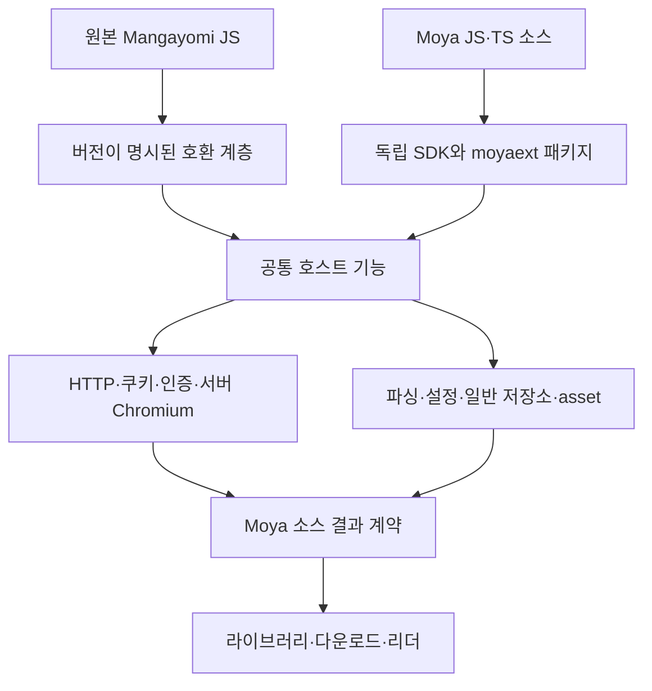

# Mangayomi JS 호환성과 Moya 확장 플랫폼 검토

검토일: 2026-09-19. 상태: **구현 제안이며 호환성 보증이나 배포 완료 보고가 아니다.**

후속 P0 구현: 문자열·기본 DOM·선택 설정 메서드·설정 기본값·소설 중복 정리를 보완하고 원본 확장 회귀
검사를 추가했다. 아래 표는 검토 당시의 발견 사항을 보존한다. 최신 구현·한계는
[Mangayomi JS 지원 범위](mangayomi-compatibility.md)를 기준으로 확인한다.

2026-09-20 후속: 독립 CLI tarball, 저장소 index 생성, 게시자 키 생성·서명 패키징을 추가했다.
[공개 릴리스 절차](publishing.md)의 명령은 checkout 밖에 설치한 실제 tarball로 검증했다.
아래 최초 검토표의 미구현 항목 전체가 완료된 것은 아니며 npm 공개 게시도 아직 하지 않았다.

## 판단

**신규 개발의 중심을 Mangayomi의 만화·소설 JavaScript 호환성과 자체 `.moyaext` SDK에 두는 것이 적절하다.**
두 경로는 JS 실행기와 서버의 HTTP·브라우저·콘텐츠 저장 기능을 공유할 수 있다. APK의 Android 클래스와
바이트코드까지 재현하는 것보다 호환성 문제를 좁혀 다룰 수 있다. 다만 JS라는 공통점만으로 기존 확장이
그대로 실행되는 것은 아니다. 확장이 호출하는 DOM, HTTP, 설정, 문자열 도우미와 실행 수명까지 맞아야 한다.

현재 Moya에는 이미 격리 실행기, 소스 계약, SDK, 개발 CLI, 설치·업데이트·복원, 인증과 서버 브라우저가 있다.
처음부터 확장 시스템을 만들 단계는 지났다. 하지만 **Mangayomi JS의 광범위한 무수정 호환성이나,
외부 개발자가 독립적으로 개발·배포·유지보수하기 좋은 공개 플랫폼이라고 말하기에는 부족하다.**
실제 upstream 확장이 사용하는 API의 누락, 동작 차이, 개발 도구의 배포와 문서 정합성을 먼저 해결해야 한다.

권장하는 방향은 Mangayomi 앱 전체를 이식하는 것이 아니라, 해당 JS 계약을 명시적으로 지원하는 호환 계층을
개선하고 그 아래의 공통 기능을 자체 SDK에서도 제공하는 것이다. 기존 `.moyaext`를 Mangayomi 형식으로
바꾸거나 기존 Mangayomi 확장을 모두 `.moyaext`로 변환할 필요는 없다.

## 검토 기준과 확인 범위

| 대상                  | 기준                                                                                                                                   |
| --------------------- | -------------------------------------------------------------------------------------------------------------------------------------- |
| Moya                  | 기반 커밋 `4950d5b12a5174cd1cd5c93093ebaa487d481a5b`와 현재 확장 안정성 작업 트리. 미커밋 수정도 포함되므로 운영 배포 상태와 구분한다. |
| Mangayomi 앱          | `aaa0aaebe70cbdc42f67fee9f29992ecd5fc4777`의 JS 실행기·HTTP·DOM·설정·유틸리티 구현                                                     |
| Mangayomi 확장 저장소 | `6004f1f8d1a56f882dadb734ce26f50c626a3850`의 개발 가이드와 실제 manga/novel JS 소스                                                    |
| 이번 실행 확인        | 기존 Moya CLI의 텍스트 예제 검사와 이미지 콘텐츠 fixture 실행                                                                          |
| 확인하지 않은 것      | Mangayomi 전체 확장의 실사이트 종단 간 실행, 호환률, 운영 배포, 새 호환 기능의 구현                                                    |

아래의 API 차이와 실제 확장 사례는 **소스 대조 결과**다. 실사이트를 실행해서 모두 실패시켰다는 의미는 아니다.
기존 UI·설치 테스트가 통과했다는 사실도 실제 upstream 확장의 본문 취득 성공률로 환산하지 않는다.

## 기존 SBXH 소스와 APK 문제가 다른 이유

같은 사이트를 읽더라도 실행 경로가 다르다.

| 경로                 | 실행 내용                                                             | 이번 방향과의 관계                                                              |
| -------------------- | --------------------------------------------------------------------- | ------------------------------------------------------------------------------- |
| 기존 SBXH `.moyaext` | Moya용 JS 소스와 선언된 호스트 기능·선택적 본문 서비스                | 이미 있는 텍스트 취득 경로를 유지한다. APK 호환 실패 때문에 교체할 이유가 없다. |
| Mangayomi JS         | 원본 JS가 기대하는 `MProvider`, `Client`, `Document`, 브라우저 bridge | Moya 서버 기능으로 API 의미를 맞추는 것이 주된 과제다.                          |
| SBXH APK             | 변환된 코드가 Android `WebView`, 쿠키·콜백 클래스를 직접 생성         | 단순히 HTTP나 JS 실행기를 제공하는 것으로 대체되지 않는다.                      |

앞선 격리 APK 검증에서는 SBXH 목록·상세·회차 조회 다음의 Android WebView 생성에서 실제 호환 한계가 드러났다.
반면 별도의 기존 `.moyaext` 표지 오류에는 외부 CDN 인증서 만료라는 다른 원인이 있었다.
동일 사이트명으로 두 문제를 합쳐 판단하면 안 된다. 상세 증거는
[기존 확장 안정성 검증](../operations/2026-09-19-extension-reliability.md)에 기록되어 있다.

Self-host web 서비스에서는 서버 Chromium으로 사이트 JS를 실행하고 결과를 리더 계약으로 돌려주는 방식이
적합하다. **Moya는 이 기능을 이미 가지고 있다.** Android API 전체를 흉내 내기보다 기존 브라우저 기능의
Mangayomi bridge 호환성을 검증하는 것이 현실적이다. 브라우저 실행이 사이트의 로그인 요구나 인증서 문제까지
자동으로 해결하는 것은 아니다.

## Mangayomi에서 실제로 가져와야 할 것

[upstream 실행기][up-service]는 JS 코드를 실행하기 전에 HTTP, DOM, 설정, 유틸리티, 영상 추출 도우미를
주입한다. 구현은 Dart/Flutter와 native bridge에 걸쳐 있다. 따라서 확장 파일이 JS라는 사실과 호스트 전체를
Node에 바로 복사할 수 있다는 주장은 다르다.

| 선택                                  | 평가                                                                                             |
| ------------------------------------- | ------------------------------------------------------------------------------------------------ |
| 앱 전체 fork 후 서버 이식             | Flutter UI·플랫폼별 브라우저·Dart/Rust 의존성까지 따라온다. 현재 서버 구조에서 권장하지 않는다.  |
| JS API 계약을 기준으로 호환 계층 보완 | 권장. 원본 확장 코드를 유지하면서 서버 호스트에 연결하고 의미 차이를 테스트할 수 있다.           |
| 독립적인 순수 JS 도우미의 선별 재사용 | 검토할 만하다. 가져온 파일의 revision·수정 내역·고지와 의존성을 관리한다.                        |
| 확장별로 원본 코드를 계속 수정        | 사이트 자체 변경이나 명확한 예외에 한정한다. 공통 API 누락을 매번 개별 소스에서 우회하지 않는다. |

두 upstream 저장소 루트는 Apache-2.0 라이선스를 제공한다. 실제 재사용 단위의 라이선스·고지와 포함된
제3자 구성 요소도 따로 확인해야 한다. 이번 검토에서는 upstream 코드를 제품에 복사하지 않았다.
[앱 라이선스][up-license], [확장 저장소 라이선스][ext-license].

그대로 복제할 동작과 의도적으로 다르게 유지할 정책도 구분해야 한다. 예를 들어 검토한
[native HTTP 구현][up-client]에는 인증서 검증 기본값이 `false`인 경로가 있다. Moya가 이를 따라
TLS 검증을 끄면 안 된다. [JS HTTP wrapper][up-http]의 `put/delete/patch`가 `http_post`로 연결되는
코드도 있어, upstream의 모든 구현을 곧바로 올바른 계약이라고 간주해서는 안 된다.

## 현재 Moya에 있는 기반

| 영역      | 확인한 구현                                                                                     | 평가                                                           |
| --------- | ----------------------------------------------------------------------------------------------- | -------------------------------------------------------------- |
| 실행 격리 | QuickJS WASM, 호스트 RPC, 호출 시간·메모리·요청 제한, 취소                                      | 재사용할 기반이 있다. native OS 접근을 확장에 줄 필요가 없다.  |
| 소스 계약 | 목록/검색, 상세, 회차, 본문, 표지; 텍스트 또는 순서가 있는 이미지 asset                         | 텍스트·만화 확장의 핵심 경로가 있다.                           |
| 자체 SDK  | `defineExtension`, `defineSource`, HTTP, asset, 설정, 일반 저장소, 브라우저, 선택적 본문 공급자 | 새 소스를 JS/TS로 작성할 수 있다.                              |
| 설치 수명 | manifest·archive 검사, 검토 후 설치, 업데이트·복원·제거, 활성 세대/무결성 확인                  | 플랫폼 기반은 있으나 각 포맷별 동작을 계속 함께 검증해야 한다. |
| 인증·세션 | credential vault, 선언형 인증 연결, 소스별 브라우저 세션, HTTP와 쿠키 공유                      | 미구현이라고 보고 새로 만들 대상이 아니다.                     |
| 브라우저  | Playwright Chromium, 소스 scope, 네트워크 권한, 제한된 동시 실행                                | self-host 실행 방식에 맞는다.                                  |
| 개발 도구 | `check/run/pack`, offline HTTP fixture, 텍스트·이미지 예제                                      | 실제 실행 가능한 개발 경로가 있다.                             |

주요 근거: [SDK 계약](../../packages/extension-contracts/source-sdk.ts),
[실행기](../../packages/extension-runtime/README.md),
[Mangayomi host](../../apps/server/src/extensions/mangayomi/host.ts),
[서버 브라우저](../../apps/server/src/extensions/source-webview.ts),
[HTTP·브라우저 쿠키 공유](../../apps/server/src/extensions/source-browser-cookies.ts).

SDK의 `http.text/asset`과 일반 응답을 반환하는 `http.request`는 서로 다른 입력 계약이다.
SDK 전체가 GET/POST와 소수 헤더만 지원한다고 묶어 설명하면 부정확하다.
또한 Mangayomi host는 `sourceBrowserHttp`를 통해 일반 요청과 이미지 요청에 세션을 연결한다.
호출 내부의 `runtime.ts`만 보고 쿠키 공유가 없다고 판단해서도 안 된다.

## Mangayomi JS 호환성의 구체적인 차이

아래 구현 판단은 [bootstrap](../../apps/server/src/extensions/mangayomi/bootstrap.ts),
[runtime](../../apps/server/src/extensions/mangayomi/runtime.ts),
[설정 변환](../../apps/server/src/extensions/mangayomi/preferences.ts),
[소설 변환](../../apps/server/src/extensions/mangayomi/novel-content.ts)을 기준으로 한다.

| 영역               | Upstream 계약/동작                                                           | 현재 Moya와 차이                                                                                                         | 영향과 우선순위                                                                              |
| ------------------ | ---------------------------------------------------------------------------- | ------------------------------------------------------------------------------------------------------------------------ | -------------------------------------------------------------------------------------------- |
| 기본 호출          | 인기·최신·검색·필터·상세·회차·페이지, 소설 HTML                              | 주요 dispatch와 결과 변환은 있다.                                                                                        | 기반 유지. 실제 결과 바이트까지 검사한다.                                                    |
| 선택 메서드        | `getSourcePreferences not implemented` 같은 선택 기능 부재를 기본값으로 처리 | 매 호출 전 `getSourcePreferences()`를 실행하며 해당 예외를 처리하지 않는다.                                              | 설정을 구현하지 않은 원본이 콘텐츠 실행 전 막힐 수 있다. P0.                                 |
| 문자열             | `String.prototype.substringAfter/Before/...`                                 | Moya는 같은 이름을 `MProvider` 메서드로 제공한다. 호출 대상이 다르다.                                                    | 실제 확장 호출과 불일치. P0.                                                                 |
| DOM                | `innerHtml`, 속성·class 조회, XPath, `getHref/getSrc` 등                     | CSS 조회·`text/outerHtml/html` 등 일부만 제공한다.                                                                       | 본문·이미지 추출이 실패하거나 `undefined`를 정상 텍스트로 조립할 수 있다. P0.                |
| HTTP               | Client 옵션, GET/POST/HEAD/PUT/DELETE/PATCH, 응답 부가 정보                  | `Client(options)`를 저장하지만 요청에 적용하지 않는다. PATCH와 `request.url` 등 일부 응답 정보가 없다.                   | timeout/redirect/form/body 의미까지 맞춰야 한다. P1.                                         |
| 설정               | `getString(key, defaultValue)`와 여러 설정 UI 형식                           | default 인자를 무시한다. bootstrap은 multi-select 기본값을 다루지만 설정 UI schema·저장은 배열을 온전히 지원하지 않는다. | 기본 주소·선택값이 달라지거나 유효성 검사에 걸릴 수 있다. P0/P1.                             |
| 실행 수명          | 서비스가 유지하는 JS runtime/extension 인스턴스                              | Moya는 호출마다 새 realm과 인스턴스를 만든다.                                                                            | 메모리 캐시·인증값·상세 조회 상태를 다음 호출에서 잃을 수 있다. P1, 실제 의존 사례부터 확인. |
| 웹 브라우저 bridge | `evaluateJavascriptViaWebview`와 native bridge 결과                          | Chromium과 `setResponse` callback은 있다. script 문자열에 `setResponse`가 있는지로 대기를 결정한다.                      | 반환 형식·지연 callback·취소·동적 handler 이름의 의미 차이를 검증해야 한다. P1.              |
| 쿠키/로그인        | native HTTP·브라우저의 세션 연결                                             | Moya에도 연결이 있다. 로그인 UI와 사이트별 흐름이 모두 동일하다는 증거는 없다.                                           | 새 쿠키 저장소 대신 기존 연결의 재시작·갱신·origin 경계를 테스트한다. P1.                    |
| 소설               | HTML 취득/정리, 일부 EPUB 기반 도우미                                        | host가 정리 함수를 추가 호출하고 결과를 TXT로 변환한다. EPUB helper는 없다.                                              | 중복 정리·서식 손실과 EPUB 미지원 구분 필요. P0/P2.                                          |
| 유틸리티           | 암호화·복호화·스크립트 unpack 등 host helper                                 | 해당 이름의 bridge가 대부분 없다.                                                                                        | 필요한 API를 사용하는 실제 대상부터 추가한다. P2.                                            |
| 진단               | 앱 개발 도구의 로그·메서드별 결과                                            | 호환 bootstrap의 `console`은 no-op이다.                                                                                  | 개발자가 실패 위치를 찾기 어렵다. 제한된 개발 로그가 필요하다. P1.                           |
| Dart·영상          | Mangayomi 전체에는 Dart 소스와 영상 추출 기능도 있다.                        | 현 JS 호환 대상과 Moya 텍스트·이미지 계약 밖이다.                                                                        | 이번 지원 목표에서 명시적으로 제외한다.                                                      |

Upstream API 근거: [DOM][up-dom], [문자열·암호화·EPUB 도우미][up-utils],
[설정][up-prefs], [HTTP 응답 모양][up-response].
메서드 이름만 추가하는 것으로 완료 처리하지 않는다. DOM의 공백·빈 결과, HTTP 본문 인코딩,
페이지 순서·중복 처리처럼 같은 코드가 다른 결과를 내는 조건을 비교해야 한다.

### 실제 확장 파일에서 확인한 사례

1. [AsuraScans][ext-asura]의 `getPageList()`는 `e.text.substringAfter(...).substringBeforeLast(...)`를
   호출한다. 현재 Moya의 같은 이름의 `MProvider` 메서드는 이 호출을 대신하지 못한다.
2. [WordRain69][ext-wordrain]와 [NovelUpdates][ext-novelupdates]는 본문 노드의 `innerHtml`을 사용한다.
   Moya의 `html` 속성과 이름이 다르므로 해당 원본 호출의 호환성이 확보되어 있지 않다.
3. WordRain69는 `getSourcePreferences()`에서 명시적 미구현 예외를 던진다. Upstream은 선택 기능으로
   처리하지만 Moya의 선행 호출은 이를 잡지 않는다. 또한 이 확장의 `getHtmlContent()`가 이미
   `cleanHtmlContent()`를 부르는데 Moya가 다시 부른다. 첫 정리로 `.entry-content`가 제거되면 두 번째
   추출이 실패할 수 있다. 검토한 [upstream 소설 취득 경로][up-novel]는 `getHtmlContent()` 결과를 표시하며
   이 단계에서 확장의 정리 함수를 다시 호출하지 않는다. 이 계약을 기준으로 기존 Moya 소스의 회귀도 함께 검사해야 한다.
4. [Anna's Archive][ext-annas]는 DOM의 `getHref`와 전역 `parseEpub/parseEpubChapter`에 의존한다.
   기본 목록 API 구현만으로 이 소스의 회차·본문 지원을 보장할 수 없다.

이 사례들은 "JS니까 거의 완벽하게 호환된다"고 현재 상태를 설명할 수 없는 구체적인 근거다.
동시에 문자열·DOM·선택 메서드 같은 상당수 문제는 Android 이식 없이 고칠 수 있는 한정된 호환 계층 문제다.

## 외부 개발자에게 제공할 수 있는 수준

**현재도 Moya 저장소를 받아 예제를 수정하면 확장을 만들 수 있다. 하지만 저장소 내부 지식 없이
독립 프로젝트에서 개발·검증·배포하는 경험은 아직 완성되지 않았다.**

| 개발 단계     | 현재                                                      | 필요한 보완                                                                       |
| ------------- | --------------------------------------------------------- | --------------------------------------------------------------------------------- |
| 시작          | JS/TS 예제, 타입 SDK, 긴 개발 가이드                      | 최소 프로젝트 생성, 단일 quickstart, 지원 플랫폼 명시                             |
| 의존성        | SDK tarball 사용 가능, npm 미게시, `private: true`        | 독립적으로 배포되는 버전 고정 SDK/CLI. npm 또는 명시적 release artifact 방식 선택 |
| 빌드          | 본 저장소의 `check/run/pack`; 정적 로컬 JS/TS/JSON import | 프로젝트 밖 Moya checkout 없이 build/test/pack 가능해야 한다.                     |
| 라이브러리    | pure JS를 프로젝트 안에 고지와 함께 포함 가능             | 검증 가능한 의존성 bundling과 라이선스 고지 방식. Node 권한 허용과 구분           |
| 디버깅        | fixture와 결과 검사, 일부 안전한 오류 코드                | 메서드·단계·확장 버전·호출 ID, 소스 위치, 민감값 제거된 로그, 개발 preview        |
| 인증/브라우저 | vault·선언형 인증·Chromium 기능                           | cookie/bearer/basic와 로그인 폼·상호작용 인증의 지원 범위를 분리한 예제           |
| 배포          | `.moyaext`, 저장소 index, 업데이트·복원, builder 서명     | 저장소 생성/검사/릴리스 CI 예제, 서명키 운영 절차, 호환 host 범위와 변경 기록     |
| 검증          | 단위·격리 HTTP·App browser 검사                           | 원본 Mangayomi corpus와 정해진 API 동작 비교, 업데이트 이후 콘텐츠까지 검사       |
| 문서          | 형식·SDK·설치·상태 저장·인증 문서 존재                    | 현재 지원 사실과 계획을 분리하고 문서의 명령을 CI에서 실제 실행                   |

[SDK README](../../packages/extension-sdk/README.md)는 독립 tarball 사용법과 CLI 분리 필요성을 명시한다.
[개발 가이드](source-development.md)에는 실행 가능한 예제와 구체적인 제한이 있다. "문서가 없다"는 평가는
틀리지만, 같은 문서의 상단 `Native 단독 실행은 후속`과 뒤의 Windows 구현 설명, `로그인 필요한 소스 SDK는
아직 남아 있다`와 뒤의 인증 연결 설명은 정리해야 한다. 후반의 최신 추가 절만 읽어야 현재 상태를 알 수 있는
구성은 외부 개발자에게 혼란을 준다.

Mangayomi의 [기여 가이드][ext-guide]에는 앱 안의 코드 편집·메서드별 결과·콘솔 확인 과정이 있다.
Moya에 같은 UI 전체를 복제할 필요는 없지만, 독립 CLI와 개발 preview로 동일한 피드백 순환은 제공해야 한다.

### 이번에 실제 실행한 개발 경로

저장소 루트에서 기존 CLI를 직접 실행했다. 설치·서명·배포를 하지 않는 offline 검사다.

```sh
apps/server/node_modules/.bin/tsx scripts/extensions/cli.ts check packages/extension-runtime/examples/text-catalog
apps/server/node_modules/.bin/tsx scripts/extensions/cli.ts run packages/extension-runtime/examples/image-catalog --method source.getContent --input packages/extension-runtime/examples/image-catalog/content-input.json --fixture packages/extension-runtime/examples/image-catalog/fixtures.json
```

텍스트 예제는 `valid: true`, 소스 1개로 통과했다. 이미지 예제는 `kind: images`와 68바이트 PNG asset의
handle·길이·SHA-256을 반환했다. **기존 SDK/도구가 작동한다는 확인이며 실사이트 호환성 검증은 아니다.**

## 권장 구조와 지원 범위



이 그림은 새 실행기를 만들자는 제안이 아니다. 기존 구현을 중심으로 중복 기능과 의미 차이를 줄이자는 것이다.
포맷별 설치·신뢰·권한 모델은 유지하고, 공유 가능한 기능과 테스트부터 공통화한다. Mangayomi 호환 API를
개선해도 자체 SDK에 자동으로 새 API가 생기지는 않으므로, 양쪽 adapter의 지원표를 함께 관리해야 한다.

첫 지원 목표는 **Mangayomi JavaScript 만화·소설 중 공개한 API 계약을 사용하는 원본 소스**다.
APK·Dart·영상 추출·Android 전용 객체는 별도 지원 범위로 유지한다. HTML→TXT는 소설 본문 확보에는
유용하지만 삽화·ruby·스타일을 보존하는 완전한 HTML/EPUB 리더 호환은 아니다. EPUB 필요 소스는 별도
기능으로 판단하고, 일부 기능을 조용히 버린 뒤 완전 지원으로 표시하지 않는다.

호출마다 초기화되는 현재 실행 방식도 즉시 장기 실행 인스턴스로 바꾸지 않는다. 원본이 호출 간 상태에
의존하는 사례를 수집하고, 안정된 설정/저장소로 해결 가능한지 먼저 본다. 인스턴스 유지가 필요하면 동시 실행,
업데이트 후 폐기, 메모리 한도, 사용자 분리를 검증하는 별도 변경으로 다룬다.

## 구현 순서와 완료 기준

| 순서            | 작업                                                                               | 완료 기준                                                                                              |
| --------------- | ---------------------------------------------------------------------------------- | ------------------------------------------------------------------------------------------------------ |
| P0: 기준 확정   | 지원 API 표, 고정된 원본 JS 표본과 fixture, 현재 문서 정정                         | 테스트가 어떤 upstream revision·소스·메서드를 검증하는지 재현 가능하다.                                |
| P0: 확인된 차이 | 선택 메서드 부재 처리, String 메서드, `innerHtml` 등 실제 사용 DOM, 소설 정리 호출 | 위 실제 확장 사례를 원본 수정 없이 fixture로 실행하고 기대 본문·페이지와 비교한다.                     |
| P1: 통신·상태   | Client 옵션·응답 의미, 기본 설정값·설정 형식, 브라우저 callback, 세션 갱신         | redirect/인코딩/쿠키/인증 만료/지연 응답/취소에서 의미가 일치한다. 쓰기 요청을 임의 재전송하지 않는다. |
| P1: 개발자 배포 | 독립 SDK/CLI, init 또는 최소 템플릿, API reference와 release CI 예제               | Moya 저장소가 없는 새 폴더에서 작성→검사→패키지→설치→업데이트가 가능하다.                              |
| P2: 추가 기능   | corpus가 요구하는 XPath·암호화·unpack·EPUB 도우미                                  | 각 기능에 실제 소스 근거와 제한·회귀 검사가 있다. 영상용 기능을 무조건 따라가지 않는다.                |
| 지속: 호환 운영 | upstream 변경 감시, 버전별 보고서, 지원 종료/이관 정책                             | 설치 성공과 콘텐츠 성공을 분리해 릴리스마다 공개한다.                                                  |

첫 변경은 P0의 작은 공통 API 차이와 검증을 한 묶음으로 제한하는 것이 좋다. 전체 실행기 교체나 모든
확장의 일괄 재작성부터 시작할 필요가 없다. APK는 기존 사용 경로를 보존하면서 확인된 한정된 결함을 고치는
수준으로 두고, 범용 Android 모방을 신규 개발의 중심에 놓지 않는다.

### 호환성 통과를 판정하는 방법

검사 단위는 패키지만이 아니라 **소스 × 메서드 × host 버전**이다. `설치됨`은 다음 단계의 출발점이다.

1. 원본 JS의 revision/hash와 필요한 API를 고정한다. 추측한 축약 구현으로만 검사하지 않는다.
2. offline fixture에서 목록·검색·페이지네이션·필터·상세·회차·본문 또는 이미지·표지를 검증한다.
3. HTML 오류 페이지나 `undefined`, 로그인 안내를 정상 본문으로 저장하지 않는지 확인한다.
4. 승인된 격리 환경에서 최소 실사이트 요청으로 결과를 확인하고, 실제 이미지/TXT 바이트를 내려받는다.
5. 재시작·설정 변경·업데이트·비활성 상태·취소 후에도 소스 identity와 세션/상태가 의도대로 남는지 확인한다.
6. 실제 App에서 검색→추가→다운로드→읽기까지 통과해야 해당 경로를 사용 가능으로 기록한다.

결과는 `호환 API 실패`, `인증 필요`, `외부 TLS/DNS/HTTP 실패`, `결과 형식 오류`, `시간/용량 제한`,
`성공`으로 구분한다. 외부 실패를 임의로 호환 성공에 포함하거나, 호환 문제를 전부 사이트 장애로 돌리지 않는다.
지원 대상과 표본 수를 공개하기 전에는 "거의 완벽" 같은 호환률을 제시하지 않는다.

최소 공개 문서 세트는 quickstart, 버전별 API reference/제한, Mangayomi 호환표, 인증·브라우저 예제,
fixture/디버깅 가이드, 패키지·저장소 배포, 업데이트·데이터 이관, 기여·문제 신고 절차다.
기존 자료를 이 구조로 정리하고 예제 명령을 CI에서 검사하는 편이 새 문서를 계속 덧붙이는 것보다 낫다.

## 결론에 따른 작업 경계

현재 기능을 버리거나 APK 사용자를 강제 이관할 이유는 없다. Mangayomi JS 호환 API의 확인된 차이를 좁혀
고치고, 자체 확장도 사용하는 공통 호스트 기능과 개발 도구에 투자하는 것이 권장 경로다.
사이트별 SBXH 구현을 하나 더 만드는 것보다, 다른 개발자의 원본 확장이 의존하는 계약을 맞추는 데 효과가 있다.

최초 검토 작성 단계에서는 문서와 문서 목차만 추가했다. 이후 승인된 P0 구현과 검증 결과는 문서 상단에서
연결한 지원표에 별도로 기록한다. 검토나 격리 검사가 운영 설치·배포 완료를 의미하지 않는다.

[up-service]: https://github.com/kodjodevf/mangayomi/blob/aaa0aaebe70cbdc42f67fee9f29992ecd5fc4777/lib/eval/javascript/service.dart
[up-dom]: https://github.com/kodjodevf/mangayomi/blob/aaa0aaebe70cbdc42f67fee9f29992ecd5fc4777/lib/eval/javascript/dom_selector.dart
[up-utils]: https://github.com/kodjodevf/mangayomi/blob/aaa0aaebe70cbdc42f67fee9f29992ecd5fc4777/lib/eval/javascript/utils.dart
[up-prefs]: https://github.com/kodjodevf/mangayomi/blob/aaa0aaebe70cbdc42f67fee9f29992ecd5fc4777/lib/eval/javascript/preferences.dart
[up-http]: https://github.com/kodjodevf/mangayomi/blob/aaa0aaebe70cbdc42f67fee9f29992ecd5fc4777/lib/eval/javascript/http.dart
[up-client]: https://github.com/kodjodevf/mangayomi/blob/aaa0aaebe70cbdc42f67fee9f29992ecd5fc4777/lib/services/http/m_client.dart
[up-response]: https://github.com/kodjodevf/mangayomi/blob/aaa0aaebe70cbdc42f67fee9f29992ecd5fc4777/lib/eval/http_response_extensions.dart
[up-novel]: https://github.com/kodjodevf/mangayomi/blob/aaa0aaebe70cbdc42f67fee9f29992ecd5fc4777/lib/services/get_html_content.dart
[up-license]: https://github.com/kodjodevf/mangayomi/blob/aaa0aaebe70cbdc42f67fee9f29992ecd5fc4777/LICENSE
[ext-license]: https://github.com/kodjodevf/mangayomi-extensions/blob/6004f1f8d1a56f882dadb734ce26f50c626a3850/LICENSE
[ext-guide]: https://github.com/kodjodevf/mangayomi-extensions/blob/6004f1f8d1a56f882dadb734ce26f50c626a3850/CONTRIBUTING-JS.md
[ext-asura]: https://github.com/kodjodevf/mangayomi-extensions/blob/6004f1f8d1a56f882dadb734ce26f50c626a3850/javascript/manga/src/en/asurascans.js
[ext-wordrain]: https://github.com/kodjodevf/mangayomi-extensions/blob/6004f1f8d1a56f882dadb734ce26f50c626a3850/javascript/novel/src/en/wordrain69.js
[ext-novelupdates]: https://github.com/kodjodevf/mangayomi-extensions/blob/6004f1f8d1a56f882dadb734ce26f50c626a3850/javascript/novel/src/en/novelupdates.js
[ext-annas]: https://github.com/kodjodevf/mangayomi-extensions/blob/6004f1f8d1a56f882dadb734ce26f50c626a3850/javascript/novel/src/all/annasarchive.js
