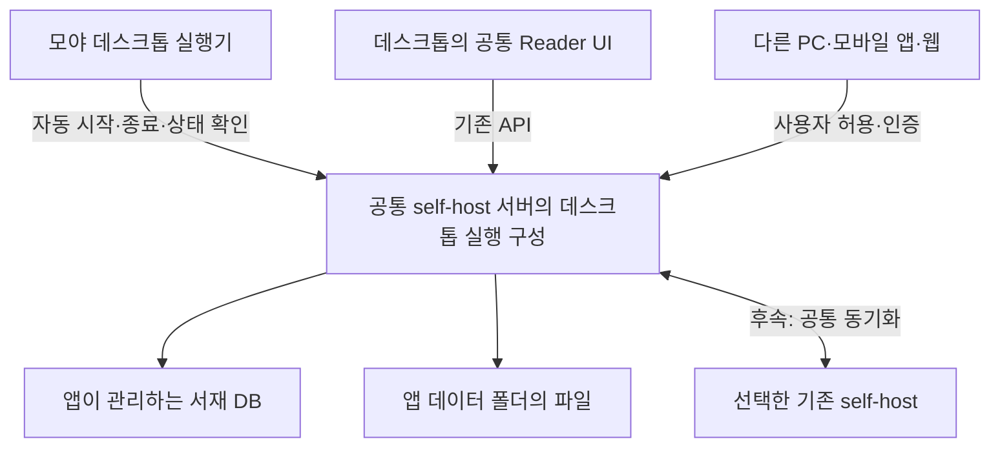

# 데스크톱 내장 self-host 구현 계획

작성: 2026-09-23. 갱신: 2026-09-24. 상태: **P0 완료. P1 복구·설치 후보의 Windows 검증 통과. P2 공통 숫자 진행률과 대용량·백업·EPUB/PDF 대표 경로 검증 추가. C1 기본 로컬 ZIP 이전, D1 빈 서재 초기 복제와 신규 독서 위치 동기화 첫 범위 검증. 일반 배포·전체 이전·전체 동기화는 미완료**.
새 작업 브랜치: `feat/desktop-embedded-selfhost`. 제품 코드 기준: `f5613f3`.
이 문서가 데스크톱 구현 순서를 정한다. 기존 로컬 완성 → 서버화 계획은 [보관 기록](2026-09-23-desktop-indexeddb-archive.md)으로 전환했다.

**현재 실행 위치:** [남은 전체 작업과 워커 실행 계획 W01~W12](2026-09-24-desktop-remaining-work-plan.md)을 따른다. 사용자 요청으로 물리 타 기기 검증은 이번 실행 범위에서 제외했다. [이전 실행 지침](2026-09-24-desktop-next-work-handoff.md)은 완료 증거와 코드 참고 자료다. A1~A3 수집기 연결, B의 실제 앱 읽기·검색·백업, C1 기본 로컬 ZIP 이전, D1 최초 복제·독서 위치, D2a 새 작품 전달은 검증했다. 원본 교체·나머지 독립 서재 동기화, 이전의 남은 자료와 장애/대용량/일반 배포 검증은 새 계획에 구체화했다.

## 1. 최종 목표와 고정 조건

**사용자는 모야만 설치하거나 압축을 풀어 실행한다. 앱이 같은 PC에서 self-host 서버를 자동 실행하고, 공통 웹 UI로 그 서버의 서재를 사용한다. 접속을 허용하면 다른 앱과 브라우저도 같은 서재를 연다.**

- Docker·WSL·개발용 Node·DB 서비스의 사용자 수동 설치를 요구하지 않는다. 필요한 실행 구성은 앱이 제공하고 관리한다.
- 기존 self-host의 API, 저장·가져오기·백업·확장·리더 기능을 최대한 공유한다. 데스크톱 서재의 정본은 앱이 관리하는 서버 DB와 파일 저장소다.
- 기존 Tauri shell과 React reader를 사용한다. 시스템 파일 선택, 창·트레이, 기기 TTS 등 필요한 OS 기능만 shell이 맡는다.
- 같은 PC의 서버는 인터넷 연결 없이도 실행되고, 이미 보관한 작품을 읽을 수 있어야 한다. 온라인 소스·외부 AI 등의 연결 요구는 해당 기능에 표시한다.
- 앱 실행 중 다른 기기에서 접속할 수 있어야 한다. 인증을 거쳐 같은 서재를 읽고 변경한다.
- 장기적으로 기존 self-host를 동기화 서버로 선택할 수 있다. 기존 서버가 없으면 이 데스크톱의 서버도 다른 앱·순수 웹의 접속/동기화 대상이 된다.
- 순수 웹과 모바일의 현재 기능을 유지한다. 브라우저의 오프라인 캐시·로컬 모드에 필요한 IndexedDB 사용과 데스크톱 서버의 데이터 소유권을 구분한다.
- EXE 한 파일에 모든 것을 압축하는 최적화는 선행 조건이 아니다. 폴더 배포·설치형 등 앱이 실행 구성을 함께 제공하는 방식으로 먼저 검증한다. 기존 포터블 실행기와 데이터 경로는 활용 후보로 유지한다.

## 2. 구현의 중심

| 책임                                          | 소유 주체        |
| --------------------------------------------- | ---------------- |
| 작품·revision·읽던 위치·주석·작업의 지속 상태 | 선택한 서재 서버 |
| 원본·이미지·백업·작업 임시 파일               | 서버 저장 계층   |
| 가져오기·다운로드·백업의 수행과 복구          | 서버 작업 실행기 |
| 화면과 진행률 표시, 사용자 명령               | 공통 웹 UI       |
| 프로세스·프로필·창·트레이·OS 접근             | 데스크톱 shell   |
| 서버 간 복제와 오프라인 변경 재전송           | 후속 동기화 계층 |

창을 숨기거나 UI를 새로 열어도 서버가 작업을 완료하고 서재에 반영해야 한다. WebView가 파일 처리 완료 후 IndexedDB에 반영해야 끝나는 구조를 새 데스크톱의 기반으로 확장하지 않는다.

## 3. 현재 코드에서 확인한 출발점

아래는 `f5613f3` 코드 확인 결과다. 기존 기능의 Windows 서버 동봉 성공을 뜻하지 않는다.

| 영역         | 확인된 코드                                                                                                          | 계획에 주는 제약                                                                                                                                                           |
| ------------ | -------------------------------------------------------------------------------------------------------------------- | -------------------------------------------------------------------------------------------------------------------------------------------------------------------------- |
| API와 서비스 | [`buildServer`](../../apps/server/src/server.ts), [`worker`](../../apps/server/src/worker.ts)                        | 기존 서버와 worker를 실행할 수 있는 구성을 먼저 만든다. 서버 업무 규칙을 새로 작성하지 않는다.                                                                             |
| DB           | [`pg.Pool`](../../apps/server/src/db/pool.ts), [`SQL migration`](../../apps/server/src/db/migrations)                | PostgreSQL 쿼리·JSONB 등에 결합되어 있다. SQLite 교체를 작은 작업으로 가정하지 않는다.                                                                                     |
| 큐           | [`queue.ts`](../../apps/server/src/queue.ts)                                                                         | import/provider가 BullMQ·Redis와 연결된다. Windows에서 제공할 실행 구성 또는 실제 호출 범위의 대체 비용을 확인해야 한다.                                                   |
| 객체 저장    | [`object-storage.ts`](../../apps/server/src/services/object-storage.ts)                                              | 현재 S3 client/명령을 사용한다. 파일 디렉터리 설정만으로 동작하는 상태가 아니다.                                                                                           |
| 배포         | [`compose.yaml`](../../compose.yaml)                                                                                 | API·worker·PostgreSQL·Redis·MinIO 등의 책임을 앱 실행 구성에서 충족해야 한다. Docker 배포는 계속 지원한다.                                                                 |
| 클라이언트   | [`reader-runtime.ts`](../../src/repositories/reader-runtime.ts)                                                      | RemoteReaderRepository, RemoteBookAssetRepository, ServerUploadImportService, RemoteBackupRepository를 재사용할 수 있다. 데스크톱용 실행 중 endpoint/auth 주입이 필요하다. |
| 실행기       | [`extension_runtime.rs`](../../src-tauri/src/extension_runtime.rs), [`portable.rs`](../../src-tauri/src/portable.rs) | 동봉 실행기·프로필·중복 실행·종료 기반이 있다. 확장 host를 완성된 서재 서버로 취급하지 않는다.                                                                             |
| 동기화       | [`서버 route`](../../apps/server/src/routes/sync.ts), [`계약`](../../src/sync/contract.ts)                           | 기존 계약과 구현을 조사해 지원표를 만든다. 모든 자료의 서버 간 동기화가 완성됐다고 가정하지 않는다.                                                                        |

서버 쪽 대용량·백업 구현도 전부 무제한/무결하다고 가정하지 않는다. 실제 데스크톱 사용자 경로에서 드러난 누락을 공통 서버 경로에서 고친다.

## 4. 첫 번째 작업: 실행 구성 결정과 작은 실제 사용 흐름

### 4.1 조사 범위와 산출물

첫 단위에서는 다음 의존성 표와 실행 증거를 만든다. 로컬 저장 기능이나 범용 adapter를 추가하는 단위가 아니다.

| 구성            | 우선 확인                                                                              | 대안을 검토할 조건                                                              |
| --------------- | -------------------------------------------------------------------------------------- | ------------------------------------------------------------------------------- |
| Node·API·worker | 기존 번들/실행기를 앱에서 시작하고 종료할 수 있는지                                    | 현재 번들에서 실제 실패하는 native module/경로만 조정                           |
| PostgreSQL      | 현재 SQL·migration을 유지하면서 Windows에서 앱 전용 데이터 폴더로 실행·재시작 가능한지 | 재배포·프로세스 관리·크기 등 구체적 문제가 확인되면 호환 DB 또는 교체 범위 비교 |
| Redis 큐        | 현재 BullMQ가 요구하는 기능과 Windows 실행 구성·배포 조건                              | 제공이 곤란하면 기존 DB 작업 기록을 활용하는 대체 범위만 작은 검증으로 비교     |
| S3 객체 저장    | 현재 사용하는 읽기/range/쓰기/copy/delete 등 호출 경계와 동봉 서비스 비용              | 로컬 파일 adapter가 더 작은 변경인지 실제 호출부로 비교                         |
| 웹 화면·인증    | 기존 웹 산출물 제공과 앱의 Remote runtime 연결                                         | 공통 UI를 유지하면서 endpoint·세션 bootstrap 연결만 보완                        |

**출발 가설은 PostgreSQL SQL과 기존 서버 업무 코드를 최대한 보존하는 구성이다.** DB·큐·객체 저장의 최종 조합은 이 조사와 실행으로 결정한다. Redis/S3까지 그대로 동봉하는 안과 필요한 경계만 대체하는 안을 비교하되, 두 제품을 병렬 구현하지 않는다.

산출물:

1. 실제 변경이 필요한 파일/호출 경계, 선택 조합, 탈락 이유를 적은 짧은 결정 기록.
2. 구성요소별 배포 크기·첫/재시작 시간·유휴/대표 작업 메모리·데이터 위치·Windows 재배포 조건.
3. 기존 Docker self-host에도 영향을 주는 공통 변경과 데스크톱 실행 설정의 구분.
4. 다음 사용 흐름의 성공/실패 기록. Windows 환경이 없으면 그 검증을 대기로 기록하고 대규모 대체 구현으로 우회하지 않는다.

### 4.2 가장 먼저 보여 줄 사용 흐름

빈 프로필에서 아래 흐름을 이어서 실행한다.

1. 모야 실행 → 앱이 서버·필요 구성요소 시작 → readiness 확인 → 앱 화면 연결.
2. 기존 서버 업로드/API로 작은 TXT 한 개 추가 → 책장 표시 → 읽기.
3. 읽던 위치 저장 → 앱과 서버 종료 → 재시작 → 같은 책과 위치 확인.
4. 인증한 브라우저에서 동일 서버의 서재를 열고 같은 작품을 확인. 첫 검사는 같은 PC의 별도 브라우저로도 가능하지만, 다음 단계 완료에는 다른 기기 접속이 필요하다.

처음에는 기존 청크 업로드를 사용해 전체 파일을 메모리에 모으지 않는다. localhost 전송 비용이 측정된 병목이면 보관 브랜치의 파일 핸들·스트리밍 경로를 선별 연결한다. 직접 파일 경로를 새로 만드는 일을 위 흐름의 선행 조건으로 늘리지 않는다.

이 단위에서 결과가 나오면 비용과 변경 범위를 정리한다. 서비스 교체나 전체 DB 이식으로 확대해야 하는 경우, 확대 이유와 대안을 먼저 보고한다.

## 5. 실행 순서와 완료 조건

| 단계                             | 사용자에게 생기는 결과                              | 구현 범위                                                                     | 완료 증거                                                                                     |
| -------------------------------- | --------------------------------------------------- | ----------------------------------------------------------------------------- | --------------------------------------------------------------------------------------------- |
| P0. 실행 구성 검증               | Docker 없는 서버 실행 가능성과 실제 비용 확인       | 4절의 의존성 조사·단일 구성·작은 사용 흐름                                    | 책 추가·읽기·위치 저장·재시작·별도 브라우저 접속 기록                                         |
| P1. 접속 가능한 앱               | 모야 실행만으로 사용하고 다른 기기도 같은 서재 이용 | 실행기, runtime 연결, 웹 제공, 인증, 접속 허용, 창·트레이·종료                | 개발용 Node/DB/Docker 없는 Windows에서 실행, 두 번째 기기의 읽기·위치 변경, 공유 해제, 재시작 |
| P2. 기존 기능 연결과 데이터 보호 | 웹/self-host의 현재 주요 기능을 앱에서도 사용       | 아래 지원표의 실제 누락, 공통 진행률, 대용량·백업·복구, 기존 자료의 직접 이전 | 대표 사용자 경로·중단/충돌에서 자료 보존·대용량 1건·백업 복원·기존 self-host 회귀             |
| P3. 동기화와 간편 접속           | 기존 self-host 또는 데스크톱을 동기화 서버로 사용   | 공통 sync 지원표·파일 전송·충돌/삭제·기기 인증·Tailscale 연결 안내/통합       | 두 기기/서버의 변경 교환, 오프라인 후 재연결, 브라우저 접속, 인증 해제                        |

P1의 기본 외부 접속을 P2 전체 완료 뒤로 미루지 않는다. 서버가 실제로 앱과 다른 기기를 지원하는지 초기에 확인한다.

### P1: 실행·접속·종료

- 앱이 프로필 lock, 내부 포트, 인증 정보, DB 초기화/migration, API/worker readiness, 종료 순서를 관리한다. 시스템 전역 DB 서비스나 고정된 기본 DB 비밀번호에 의존하지 않는다.
- DB/큐/객체 저장의 관리 포트는 앱 내부 용도로 제한한다. 다른 기기에 제공하는 것은 인증된 서재 API와 웹 화면이다. native 파일 경로 등록·vault 제어를 외부 서재 API로 공개하지 않는다.
- 기본 접속 범위는 이 PC다. `다른 기기 접속 허용`을 켤 때 기본 방식은 **Cloudflare Quick Tunnel**이다. 앱이 동봉 연결기를 시작해 임시 HTTPS 주소를 만들고, 주소·QR·로그인 안내를 제공한다. 별도 Cloudflare 계정·도메인·Docker 설치를 요구하지 않는다. 공유 해제 시 터널과 외부 연결을 닫고 이 PC 읽기는 유지된다. (2026-09-24 사용자 지정)
- 다른 접속 방식으로 같은 네트워크/Tailscale의 직접 접속과 사용자 계정의 고정 Cloudflare 터널을 제공한다. 고정 터널은 사용자가 공개 호스트/터널을 준비하며, 앱은 입력한 토큰으로 연결한다. 토큰은 이번 실행에만 사용하고 저장하지 않는다. Quick Tunnel의 임시 주소·가동 시간 미보장·SSE 미지원 제약은 [공식 문서](https://developers.cloudflare.com/cloudflare-one/networks/connectors/cloudflare-tunnel/do-more-with-tunnels/trycloudflare/)를 따른다. 선택 방식의 기본값과 외부 접속 자동 허용은 구분하며, 앱 재시작 후 외부 접속은 꺼져 있다.
- 원격 접속 화면은 웹과 데스크톱이 공유한다. QR 코드·주소 복사·접속 상태를 표시하고, 데스크톱에서 접속 허용/해제를 제어한다. QR에는 주소만 담고 기존 계정 로그인을 사용한다. 사설망/Tailscale 주소와 외부 HTTPS 터널 주소를 구분하며, 아직 없는 터널 연결을 완료된 기능으로 표시하지 않는다. (2026-09-24 사용자 요청 반영)
- 앱 UI는 기존 공통 UI와 Remote repositories를 사용한다. 앱에서 선택한 endpoint를 전달하고 기존 인증/세션을 재사용한다. 비밀 토큰을 URL에 넣지 않는다.
- `창 닫기 → 트레이에서 유지 / 서버 종료 / 돌아가기`를 연결한다. 서버 유지 중에는 WebView가 없어도 작업이 반영되어야 한다. 완전 종료에서는 새 작업 입장을 닫고 작업 상태를 저장한 뒤 worker/API/저장 구성요소를 순서대로 종료한다.
- 강제 종료·포트 충돌·디스크 부족·중복 실행을 작은 입력으로 확인한다. 업데이트 시 실행 파일과 사용자 데이터를 분리하고, 데이터 버전이 맞지 않는 실행을 차단한다.
- 배포 크기는 전체 합계와 구성요소별로 보고한다. 아직 제공하지 않는 필수 구성요소를 빼서 작은 배포물처럼 표시하지 않는다. 단일 EXE 압축이나 추가 플랫폼 작업은 이 단계의 기능 검증을 지연시키지 않는다.

### P2: 기존 기능을 연결하는 지원표

구현 전에 각 항목을 `기존 서버 경로 사용 / 데스크톱 연결 보완 / 기능 자체 보완 / 검증 대기`로 표시한다. 아래는 조사 대상이며 모두 새 구현할 목록이 아니다.

| 사용자 기능                                      | 재사용 출발점                                    | 확인할 연결/차이                                                            |
| ------------------------------------------------ | ------------------------------------------------ | --------------------------------------------------------------------------- |
| 책장·TXT/EPUB/만화/PDF 읽기, 검색·읽던 위치·주석 | 기존 Remote reader/asset/catalog/personalization | 실행 중 서버 선택, 세션, range 응답, 기기별 UI 설정                         |
| 파일 가져오기·회차 추가·내보내기                 | 서버 upload/import·archive·source-download       | 로컬 파일 입력, 취소·재시도, 실제 대용량·임시 공간                          |
| 소스·확장·인증·프록시                            | 서버의 현재 소스/확장 관리 경로                  | 선택한 서재 서버에서 수행, 기존 native host와 중복 실행/중복 계정 저장 방지 |
| AI·TTS·기능 확장                                 | 서버와 공통 UI의 현재 지원 경로                  | 키·작업 수행 주체, 기기 오디오/시스템 TTS 등 native capability              |
| 백업·복원                                        | 기존 RemoteBackupRepository와 서버 백업          | 앱의 저장 선택, 복원 정책·충돌·원본/표지/독서 기록 확인                     |
| 진행률·작업 복구                                 | 기존 서버 작업 상태·클라이언트 polling           | 실제 완료량, 단계 전환, 취소·재시도·재실행 표시                             |

**진행률 중앙에는 숫자 퍼센트를 표시한다.** 업로드는 서버가 확인한 바이트, 이미지 다운로드는 검증·저장 완료 이미지/확정된 이미지 수를 사용한다. 총량을 모르면 단계만 표시한다. 임의 가중치로 전체 완료율을 만들지 않으며, 전송 종료와 서재 반영 완료를 구분한다. 보관 브랜치의 UI/계약은 필요한 변경만 재사용한다.

대용량 검증은 기존 제한을 넘는 대표 파일 한 건을 사용해 실제 앱→서버→저장→읽기/내보내기를 잇는다. 파일 크기·시간·메모리·임시 공간을 기록하고 실패한 경계를 수정한다. 입력 최대치와 모든 사이트를 한 번에 검증하는 작업으로 확장하지 않는다.

### 기존 자료의 이전

- 새 설치의 서버 사용 흐름을 먼저 확보한다. 기존 사용자 자료 이전을 새 서버 실행의 필수 선행 단계로 만들지 않는다.
- 현재 사용 중인 프로필이 기존 IDB인지, 보관 브랜치의 native 참조까지 포함하는지 확인한다. 개발 작업을 했다는 이유만으로 모든 사용자에게 중간 스키마가 배포됐다고 가정하지 않는다.
- 필요한 경로는 **기존 프로필/백업 → 최종 서버 저장소**다. `IDB Blob → 별도 로컬 파일 구조 → 서버 DB`의 중간 제품을 완성하지 않는다.
- 기존 ID·revision·읽던 위치·주석·필수 설정·미전송 변경을 보존한다. 로컬 v1 백업과 서버 백업의 호환성을 확인하고, 호환되지 않으면 해당 읽기 변환만 추가한다.
- 변환은 복사·검증·전환 순서이며 기존 프로필을 보존한다. 이미 열었던 새 버전 프로필을 `f5613f3` 실행 파일로 열어 되돌리지 않는다. 코드 기준점 선택은 사용자 데이터 다운그레이드가 아니다.

### P3: 접속과 동기화

- `서버 서재 열기`는 해당 서버의 데이터를 바로 사용하는 기능이다. `이 PC에 보관하고 동기화`는 독립 사본과 오프라인 변경을 교환하는 별도 기능으로 표시한다.
- 데스크톱을 사용하는 경우 로컬 사본의 소유자는 내장 서버다. 별도의 데스크톱 IndexedDB 정본을 추가하지 않는다. 순수 웹/모바일의 기존 오프라인 저장과 cache는 각 클라이언트 계약으로 유지한다.
- 현재 event·snapshot·원본 전송·삭제·충돌·프로토콜 협상 지원표를 작성한다. 내장 서버와 기존 self-host가 같은 의미의 계약을 사용하도록 누락을 보완한다.
- 서재별 동기화 서버 하나를 먼저 지원한다. 기존 self-host가 있으면 그 서버를 선택하고, 없으면 데스크톱 서버를 선택할 수 있게 한다. 서버 간 전송과 브라우저 클라이언트 전송의 어댑터 차이는 있어도 별도 동기화 규칙을 만들지 않는다.
- Tailscale을 이용한 주소 도달 가능성과 모야의 인증/동기화는 구분한다. 초기에는 이미 연결된 사설망에서 접속을 검증하고, 후속으로 연결 상태·주소·설정 안내를 제공한다. 순수 웹의 HTTPS/CORS 조건을 함께 검증한다.
- PC 절전·앱 완전 종료 중에는 해당 PC 서버에 접속할 수 없다. 연결 상태를 표시하고, 보관한 사본은 오프라인 읽기와 재연결 후 동기화를 검증한다.

## 6. 기존 작업 처리 원칙

보관 위치와 commit은 [보관 기록](2026-09-23-desktop-indexeddb-archive.md)에 고정했다.

- 보관 브랜치 전체 merge/cherry-pick은 하지 않는다. 각 변경의 필요성·현재 서버의 동등 기능·IDB 의존성을 확인한다.
- 파일 스트리밍·검증 helper, 퍼센트 UI, 오류 재현 fixture는 재사용 후보다. 재사용 가능성을 확인한 뒤 필요한 함수/변경만 가져온다.
- IndexedDB 활성화 영수증·snapshot 복원·미완성 Blob 이전의 추가 개발은 중단한다. 기존 자료를 읽는 데 필요한 최소 호환 코드는 최종 서버 이전 범위에서 판단한다.
- 서버에 이미 같은 기능이 있으면 그 구현을 사용한다. 보관 코드를 살리기 위해 두 번째 작업 실행기·백업 체계·데이터 정본을 유지하지 않는다.

## 7. 범위와 비용을 통제하는 작업 규칙

1. 매 작업 단위에 **사용자에게 생길 결과 하나와 완료 검사**를 먼저 정한다. 첫 단위는 4절의 실행 구성/작은 사용 흐름이다.
2. 단위가 끝날 때 `사용 가능해진 기능 / 실행 증거 / 남은 의존성 / 다음 한 단위`를 보고한다. 커밋 수·코드 줄 수를 제품 진척도로 사용하지 않는다.
3. UI에서 끝까지 실행해 볼 수 있는 경로를 일찍 만든다. 준비 계층만 연속으로 확장하지 않는다.
4. 비교가 필요한 경우 문서/호출부 조사와 하나의 작은 실행으로 좁힌다. 대안별 완제품, 범용 framework, 전체 DB 이식을 동시에 시작하지 않는다.
5. 테스트는 변경 관련 검사와 대표 사용 흐름으로 한정한다. 큰 입력 검사는 작은 흐름을 통과한 후 실행하고, 같은 실패를 해소할 목적 없이 반복하지 않는다.
6. 예상보다 큰 결합이나 새 필수 의존성이 나오면 해당 사실과 범위 변경을 보고한다. 이전 계획의 미완성 항목을 자동으로 현재 작업 목록에 추가하지 않는다.
7. 주간 할당량 사용률·미검증 구현 기간을 임의로 추정하지 않는다. 새 작업을 시작하기 전에 이번 단위가 최종 목표에 직접 기여하는지 확인한다.

## 8. 현재 인계 상태

실행 구성과 실제 결과는 [P0 결정·검증 기록](2026-09-23-desktop-embedded-runtime-decision.md)을 따른다. 기존 서버의 PostgreSQL·BullMQ/Redis와 Remote UI를 유지하고 서버 파일 저장 경계에 디스크 backend를 추가했다.

- [x] 기존 로컬 저장 확장과 미커밋 작업을 별도 보관 브랜치에 저장.
- [x] 해당 확장 전 기준점에서 새 작업 브랜치 생성.
- [x] 기존 서버 의존성과 Remote runtime 코드 확인, 목표·순서 재작성.
- [x] P0의 Windows 실행 구성과 서버·웹의 실제 사용 흐름 검증. 이후 P1의 Tauri 앱 창 연결/설치 검사도 통과했으며 아래 남은 조건과 구분한다.
- [ ] P1 접속 가능한 앱.
- [ ] P2 주요 기능 연결·이전·데이터 보호.
- [ ] P3 동기화·간편 접속.

브랜치 분리와 계획 재작성 후 사용자 승인으로 P0 구현을 시작했다. Tauri 자동 연결·시작 오류·트레이/종료·사설망 접속 허용·공통 QR 화면을 구현했고 Windows 후보 앱의 실제 사용 검사를 통과했다. Cloudflare Quick Tunnel을 기본 방식으로 추가했고 Linux에서 실제 HTTPS 로그인·해제를 통과했다.

2026-09-24에는 OS 잠금과 소유 프로세스 확인을 사용하는 비정상 종료 복구, VC 런타임/WebView 준비를 포함하는 Windows 설치 후보, 공통 중앙 숫자 퍼센트를 추가했다. Linux에서 launcher 강제 종료 후 복구, 529MiB 만화 가져오기→읽기→원본 해시 검증, 새 프로필에 서버 백업 복원 후 재시작을 통과했다. Windows 설치/복구 결과와 일반 새 PC 검증은 구분하여 기록한다. 기본 로컬 ZIP 이전과 동일 작품 독서 위치 서버 간 동기화 첫 범위를 검증했으며, 실제 별도 기기, 전체 자료 이전과 전체 동기화는 아직 남아 있다. 자세한 범위는 [P2 기능 지원표](2026-09-24-desktop-feature-support.md)를 따른다. 기존 Docker 운영 서비스와 다른 작업자의 변경은 수정하지 않았다.

[Windows 최종 실행 35911331300](https://github.com/west-truth/moya-reader/actions/runs/35911331300), 코드 `3e747f1`: 복구·native 앱·공통 리더·백업 복원·EPUB/PDF와 NSIS 설치본 생성/설치/실행을 모두 통과했다. 설치한 release 앱은 개발 도구 PATH 없이 동봉 서버를 시작하고 종료했다. 설치 파일은 129,088,926바이트(약 129MB)다. CI runner에 VC/WebView가 이미 있는 조건이므로 모든 필수 구성 미설치 상태의 새 PC 검사까지 통과한 것은 아니다.
