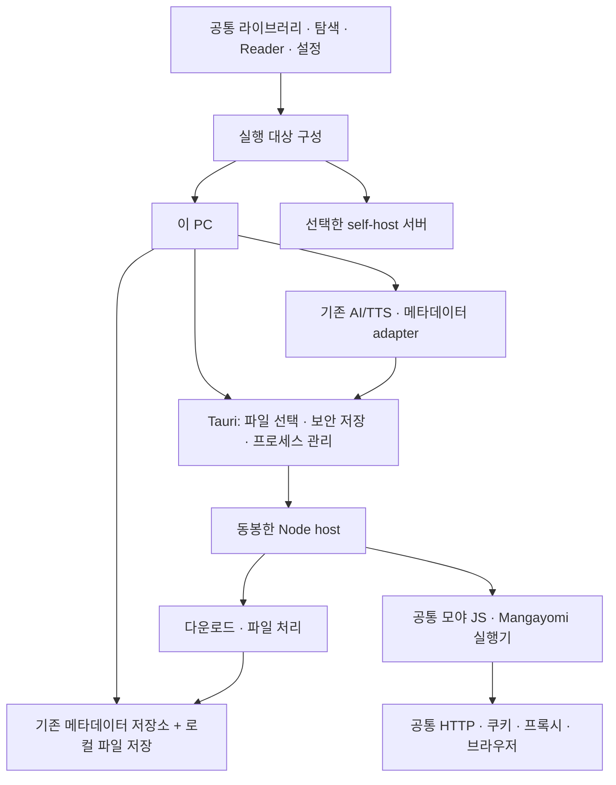

# 데스크톱 포터블 단독 실행과 공개 릴리즈 계획

작성일: 2026-09-23. 검토 기준: `40ee131` (PR #61 병합 상태).
상태: **구현 중**. P0 포터블 빌드·프로필 경로를 개발 중이며 Windows 실제 실행은 아직 검증 전.
사용자 확정 사항: **설치 프로그램이 아닌 `Moya.exe` 단일 배포물, 포터블 실행**.

## 1. 결론과 목표

추진할 가치가 있다. 현재 Tauri 앱, 공통 Reader, 로컬 AI/TTS, Node 기반 확장 실행기가 이미 있다. 이 기반을 완성하면 Docker나 별도 서버 설치 없이 콘텐츠 소스에서 작품을 찾고, 내려받고, 읽고, 백업하는 데스크톱 앱을 제공할 수 있다.

다만 현재 실행 파일을 그대로 배포하는 것만으로 self-host와 같은 사용성을 얻지는 못한다. 최근 대용량 가져오기·백업 개선은 주로 서버 경로에 적용됐고, 데스크톱은 브라우저 저장·파일 처리 경로가 남아 있다. 실행기 동봉, 데이터 이동성, 기본 프록시 설정, 실제 업그레이드도 릴리즈 관점에서 보완해야 한다.

첫 공개 대상은 기존 기반이 있는 **Windows x64**로 제안한다. Windows 11을 우선 검증하고, Windows 10 지원 표기는 실제 실행을 확인한 범위로 정한다. macOS·Linux·ARM64는 후속 단계다. UI나 소스 코드를 새 프레임워크로 이식하지 않는다. 기존 NSIS 설정은 현황일 뿐이며 이번 계획의 산출물은 아니다.

첫 릴리즈의 사용자 경험:

- `Moya.exe`를 받아 실행하고, 계정·서버 주소 없이 `이 PC에서 사용`으로 시작한다.
- 서재·설정·확장은 EXE 옆 `MoyaData/`에 보관한다. EXE와 이 폴더를 함께 옮기면 다른 경로·PC에서도 이어서 사용한다.
- 내 파일을 추가하거나 소스 저장소를 등록해 검색 → 회차 다운로드 → 읽기까지 진행한다.
- 기존 기능 확장을 로컬에서 사용하고, 필요한 API 키·로그인은 해당 기능에서 설정한다.
- 파일·읽기 기록·설정·다운로드 작업이 재실행과 앱 업데이트 뒤에도 유지된다.
- self-host 연결은 선택 사항이다. PC와 서버 중 어디에서 실행·보관하는지 짧고 분명하게 표시한다.

## 2. 확인한 구현과 실제 차이

아래는 현재 코드에서 확인한 사실이다. 과거 문서의 빌드 성공 기록을 이번 커밋의 포터블 배포물 검증으로 간주하지 않는다.

| 영역                 | 현재 확인한 구현                                                                                                                                                 | 릴리즈 전 필요한 일                                                                                                     |
| -------------------- | ---------------------------------------------------------------------------------------------------------------------------------------------------------------- | ----------------------------------------------------------------------------------------------------------------------- |
| 앱·리더              | Tauri v2, 공통 React Reader, Windows 창 제어, NSIS 설정이 있다.                                                                                                  | NSIS와 별도의 포터블 EXE 빌드, 첫 실행·업데이트·폴더 이동을 확인한다.                                                   |
| 모야 소스 확장       | `LocalInstalledExtensions` → `NativePackageExecution` → 로컬 Node 실행기 → 공통 격리 런타임이 연결돼 있다.                                                       | 패키징된 실행기로 저장소 등록·설치·업데이트·복구까지 검증한다.                                                          |
| Mangayomi JS         | 서버와 같은 `MangayomiExtensionHost`를 데스크톱 실행기가 사용한다. 별도 native smoke 스크립트도 있다.                                                            | 실제 사용자 소스의 필터·표지·목록·본문·쿠키·재실행을 포터블 배포물에서 확인한다.                                        |
| 기능 확장            | Reader 보조 기능, AI/TTS workflow, 메타데이터 수집기는 공통 trusted extension 구조다. AI/TTS의 Rust 실행·보안 저장·작업 기록도 있다.                             | 서버 없는 기능별 연결을 확인하고 실패·필수 구성요소 누락 상태를 UI에 연결한다.                                          |
| 외부 기능 플러그인   | 임의의 community UI/workflow 플러그인을 설치하는 일반 로더는 없다. `AppExtensionManager`는 sandboxed trusted 등록을 거절한다.                                    | 기존 내장 기능 지원과 제3자 기능 플러그인 생태계를 혼동하지 않는다. 후자는 별도 후속 과제다.                            |
| APK                  | 로컬 Java 실행기·패키징 코드가 있다. 완전한 Android 환경은 아니다.                                                                                               | 기존 호환 범위만 유지하고 JS 소스 릴리즈를 APK 전체 호환에 묶지 않는다.                                                 |
| 기본 프록시          | 공통 네트워크 정책은 있지만 `LocalInstalledExtensions`에는 `networkSettings`가 없고 native host에도 해당 관리 경로가 없다. UI는 이 메서드가 없으면 숨겨진다.     | 기본 프록시와 소스별 상속/직접 연결/개별 프록시를 로컬 실행기에 연결한다.                                               |
| 웹 기반 소스 실행    | `SourceWebViewHost`는 Windows에서 Edge 채널을 사용한다. 메타데이터 인증도 시스템 브라우저를 찾는다.                                                              | WebView2와 Edge 실행 파일을 별도로 진단한다. 브라우저·인증 프로필 격리와 종료를 확인한다.                               |
| 실행기 오류          | native entry가 APK/Mangayomi 초기화 실패를 `undefined`로 바꾸고, 로컬 manager도 일부 refresh 오류를 삼킨다. vault가 없으면 Mangayomi host도 생성되지 않는다.     | “소스가 없음”과 “실행기/보안 저장소를 열 수 없음”을 구분한다. 기능별 상태와 재시도를 제공한다.                          |
| 포터블 데이터·비밀값 | Rust host는 `app_data_dir()`와 OS keyring을 사용한다. Node 실행 파일/모듈·수집기는 외부 bundle resources다.                                                      | EXE만 복사하면 충분하다고 간주하지 않는다. 데이터 경로, 리소스 준비, vault와 브라우저 프로필의 PC 이동을 함께 설계한다. |
| 로컬 서재            | `createReaderRuntime()`의 local 경로는 IndexedDB repository와 `BrowserImportService`를 사용한다. 별도 desktop 파일 저장 adapter는 없다.                          | 원본·대용량 이미지의 파일 기반 보관과 가져오기·내보내기를 보강한다.                                                     |
| 대용량 EPUB          | browser import worker에서 EPUB은 전체 `ArrayBuffer`를 읽는다. CBZ 등 archive에는 부분 읽기 경로가 있어 모두 같은 문제는 아니다.                                  | 서버에서 완성한 파일/entry 기반 처리 방식을 desktop에 연결한다.                                                         |
| 로컬 백업            | 현재 `IndexedDbBackupRepository`는 비압축 합계 **256MiB·500항목**, 기존 합본 Blob 내보내기는 **500MiB** 제한이다.                                                | 파일 스트리밍 백업·복원·합본 내보내기를 제공한다. 서버의 새 한도가 자동 적용된다고 표시하지 않는다.                     |
| 파일 선택·저장       | `createPlatformDocumentIo()`와 folder IO는 Android 외에는 browser adapter를 사용한다. `nativeFileSave` capability는 Tauri 전체에 true라 실제 구현과 차이도 있다. | 데스크톱의 네이티브 열기/저장·폴더 선택과 지원 표시를 맞춘다.                                                           |
| 서버 연결            | 현재 sync API 연결만 있어도 provider 실행이 server로 선택되고, 소스 manager도 `providerApiClient`를 따라 remote로 바뀐다.                                        | 동기화 연결이 로컬 확장 실행을 자동으로 바꾸지 않도록 대상 선택을 분리한다.                                             |
| 공개 배포            | GitHub Releases 조회에 공개 릴리즈가 없었다. 기본 identifier는 `com.local.noveldeskreader`, 앱 버전은 `0.1.0`이다. updater 설정도 없다.                          | 안정적인 앱 ID·포터블 데이터 위치·버전·EXE 교체 절차를 확정한다.                                                        |
| CI                   | Windows job은 Rust 검사와 native source 검사다. 실제 배포물 생성·번들 확장 검사는 현재 job에 없다.                                                               | 변경 범위 검사와 릴리즈 후보 포터블 검증을 분리해 추가한다.                                                             |

주요 근거:

- [앱 실행 대상 결정](../../src/app/runtime/app-runtime.ts), [로컬/서버 저장소 구성](../../src/repositories/reader-runtime.ts), [확장 manager 선택](../../src/App.tsx)
- [로컬 확장 관리](../../src/extensions/packages/local-installed-extensions.ts), [native 전송](../../src/platform/tauri/native-package-execution.ts), [실행기 진입점](../../scripts/extensions/native-entry.ts), [loopback host](../../scripts/extensions/native-host.ts)
- [Rust 프로세스 관리](../../src-tauri/src/extension_runtime.rs), [Windows 번들 생성](../../scripts/extensions/bundle-native.mjs), [APK 번들 의존성](../../scripts/extensions/bundle-apk-runtime.mjs)
- [기능 확장 등록](../../src/extensions/app-extension-runtime.ts), [기능 확장 신뢰 경계](../../src/extensions/app-extension-manager.ts), [소스 브라우저](../../apps/server/src/extensions/source-webview.ts)
- [파일 IO](../../src/platform/document-io.ts), [가져오기 worker](../../src/services/import/import-worker.ts), [로컬 백업](../../src/storage/indexeddb-backup-repository.ts), [합본 내보내기](../../src/repositories/comic-source-export.ts)
- [Windows 설정](../../src-tauri/tauri.windows.conf.json), [CI](../../.github/workflows/quality.yml), [기존 네이티브 빌드 안내](native-build-guide-ko.md)

## 3. 첫 릴리즈의 지원 범위

### 포함

- 현재 Reader·라이브러리·탐색·저장공간 UI와 설정을 공유한다. 데스크톱에서 기능을 따로 재구현하지 않는다.
- `.moyaext` 및 **Mangayomi JavaScript** 소스: 저장소, 설치/업데이트, 활성화, 설정, 상세 필터, 목록/검색, 표지, 회차 다운로드.
- 기존 내장 기능 확장: Reader 정보, AI 분석/TTS 준비, 메타데이터 수집. API 기반 기능은 사용자의 키와 인터넷 연결이 필요하며, 단독 앱이 곧 모델의 오프라인 실행을 의미하지는 않는다.
- 로컬 가져오기·합치기·원본 내보내기·백업/복원. 일반 EPUB·ZIP·CBZ의 대용량 지원은 파일 기반 경로를 완성한 뒤 서버와 같은 **파일당 최대 4GiB 목표**로 맞춘다. 다른 형식과 텍스트 파싱 한도는 따로 유지한다.
- 기본/소스별 프록시, 짧은 소스 오류 안내와 진단 복사, 앱 재실행 후 다운로드 이어받기.
- 선택적인 self-host 연결. 이 PC의 서재와 서버 서재, 동기화와 원격 실행을 구분한다.

### 첫 릴리즈 범위 밖

- 모든 APK·Dart·영상 확장 호환, Android WebView 전체 재현.
- 임의 React UI나 native 실행 파일을 설치하는 범용 기능 플러그인 로더.
- PC 전원이 꺼져도 계속되는 다운로드, 앱 종료 뒤 자동 실행되는 별도 시스템 서비스.
- macOS/Linux 동시 배포, ARM64, 설치형 NSIS/MSI, 다중 계정/다중 프로필, 대규모 저장소 교체.
- 서버·PC 서재의 무조건 자동 합치기, 키·쿠키·프록시 주소의 자동 동기화.

APK는 기존 호환 옵션으로 취급한다. 기본 JS 릴리즈 빌드가 미리 만들어 둔 Java JAR를 무조건 요구하는 결합부터 해소한다. APK 포함 빌드가 필요하면 별도 명시적 빌드 옵션과 호환표로 제공하고, 범용 런타임 다운로드 관리자를 먼저 만들지는 않는다.

## 4. 구현 구조

### 4.1 공통 제품 + 로컬 host



권장안은 기존 Tauri + Node host를 확장하는 것이다. Docker/PostgreSQL/Redis/MinIO 전체를 PC에 설치하지 않는다. Electron 전환이나 모든 서버 로직의 Rust 재작성도 필요하지 않다. 현재 서버 폴더에 있는 host 모듈을 공유하는 구조를 우선 유지하고, DB/S3에 묶인 부분만 작은 파일/작업 adapter로 분리한다.

### 4.2 실행 대상과 데이터 소유권

- 기본은 `이 PC`. 서버를 연결해도 로컬 소스와 API 키가 사라지거나 자동 전환되지 않는다.
- 소스 설치 화면에만 `이 PC` 또는 `서버: 이름`을 표시한다. 일상적인 탐색·Reader에 내부 실행기 설명을 반복하지 않는다.
- 소스 목록·쿠키·프록시·캐시 키에는 실행 대상과 계정 범위를 포함한다. 서버 목록의 항목을 로컬 소스 ID만으로 재사용하지 않는다.
- 첫 버전은 같은 탐색 탭에서 서버/로컬 설치본을 자동으로 혼합하지 않는다. 기존 단일 활성 대상 구조를 보존한다.
- 실행 대상 전환은 진행 작업을 숨기지 않고, 다른 대상에서 재시작하거나 이중 실행하지 않는다.
- 서버 동기화와 Cloud Vault는 기존 계약을 따른다. 새 파일 adapter를 거쳐도 기존 읽기 기록이 이어지는지 확인하며, 미지원 합본 전송은 그대로 명시한다.

### 4.3 로컬 파일과 백업

첫 단계는 **IndexedDB의 메타데이터 구조를 유지하고 큰 바이너리만 포터블 데이터 폴더로 옮기는 방식**을 권장한다. WebView의 데이터 디렉터리도 창 생성 전에 `MoyaData/` 아래로 지정해 IndexedDB·설정이 OS 기본 AppData에 남지 않게 한다. 이 방식은 SQL 전체 이전보다 변경 범위가 작지만, 현재 asset transaction·삭제·backup·import 코드가 IndexedDB Blob을 직접 다루므로 `BookAssetRepository` 하나 교체하는 것으로 끝나지는 않는다.

- 원본·추출 이미지·음성·캐시·임시 파일의 보관 위치를 나누고, 대용량 바이너리를 WebView IPC의 base64/JSON으로 왕복시키지 않는다.
- 파일 선택 시 host가 승인한 handle을 전달한다. Reader는 기존 `RandomAccessBookSource` 계약으로 필요한 범위만 읽는다. 확장에는 임의 디스크 경로를 주지 않는다.
- EPUB·CBZ의 파일/entry 파서, 스트리밍 해시·ZIP64 코드 등 이미 검증한 부분을 재사용한다. 전체 결과를 `Map<string, Blob>`에 모으는 native 회차 수신 경로도 파일 handle/stream 경로로 바꾼다.
- 파일 기록 → 검증 → 메타데이터 확정 순서와 실행별 staging 기록을 둔다. 중단된 자기 작업만 정리하며, 다른 실행의 파일을 orphan으로 추측해 삭제하지 않는다.
- 기존 IndexedDB 사용자는 바이너리를 복사·검증한 뒤 참조를 바꾼다. 실패 시 기존 데이터를 계속 열 수 있어야 한다. 별도 대형 마이그레이션 프레임워크는 만들지 않는다.
- native backup은 원본·서재·읽기 위치·메모·설정을 스트리밍 저장한다. 서버와 로컬의 현재 백업 표현이 다르므로 재사용 가능한 manifest/검증과 변환 규칙을 먼저 확인한다. 같은 `.zip`이라는 이유로 상호 복원을 보장하지 않는다.
- 소스 저장소 주소·설치 버전·비밀값 없는 설정은 이전할 수 있게 하되, 확장 코드 설치·권한은 복원 후 다시 검토한다. API 키·쿠키·OS keyring은 일반 서재 백업에 넣지 않는다.
- 저장공간은 앱이 쓰는 파일 종류별 사용량과 **그 데이터 폴더가 있는 볼륨의 여유 공간**을 보여준다. 임시 폴더가 다른 볼륨이면 작업별로 함께 검사한다. 임의 서비스 강제 한도는 이번에 추가하지 않는다.
- 저장한 경로는 포터블 루트 기준 상대 경로 또는 논리 ID로 관리한다. 다른 드라이브 문자·PC로 옮겨도 보관한 원본/회차를 찾을 수 있어야 한다. 외부 폴더를 연결한 경우에만 필요 시 다시 선택하게 한다.

### 4.4 네트워크와 실행기

- native host에 공통 `source-network-settings` 관리 경로를 추가하고 `.moyaext`·Mangayomi가 같은 정책을 사용한다.
- 기본 프록시 + 소스별 `기본값 사용 / 직접 연결 / 개별 설정`을 제공한다. 목록·표지·본문·브라우저 요청과 저장소 다운로드 경로를 확인한다.
- 기존 서버의 Docker 서비스명이나 `127.0.0.1` 프록시 주소는 다른 PC에서 같은 대상을 가리키지 않는다. 주소를 자동 복사하지 않고 PC에서 접근 가능한 프록시를 사용한다. ByeDPI는 별도 실행 중인 프록시에 연결하는 방식부터 지원한다.
- 앱 WebView2, 소스용 Edge/Chromium, 메타데이터 인증 브라우저는 역할이 다르다. 시스템 Edge를 활용하되 없거나 실행 실패하면 짧은 진단과 설치/재시도 안내를 제공한다. 개발용 Playwright 캐시를 전제로 하지 않는다.
- 실행기 시작 응답에 기능별 준비 상태를 포함한다. 보안 저장소 잠금·리소스 누락·host 시작 실패를 빈 소스 목록으로 감추지 않는다.
- 기존 loopback 임의 포트·세션 토큰·Origin/Host 확인, guest 권한·실행 한도·서명/업데이트 검증을 유지한다. localhost라는 이유로 인증을 없애지 않는다.
- 새 로컬 파일 API는 host 소유 작업에만 연결한다. QuickJS guest나 페이지 스크립트에 Node/OS API를 노출하지 않는다. APK의 호환·신뢰 범위를 JS 격리와 같다고 설명하지 않는다.

### 4.5 데스크톱 UX와 작업 수명

- 첫 실행 화면은 라이브러리이며 `파일 추가`와 `소스 추가`를 제공한다. 긴 환경 설정 마법사는 두지 않는다.
- 네이티브 파일 열기/저장·폴더 선택, 드래그 앤 드롭, 파일을 EXE에 끌어 놓아 열기를 지원한다. 파일 연결·시작 메뉴·자동 시작·레지스트리는 자동 등록하지 않는다. 같은 데이터 폴더의 두 번째 실행은 기존 창으로 전달하고, 다른 포터블 폴더의 데이터는 섞지 않는다.
- 창 크기·위치를 저장하고 배율 변화·모니터 제거 시 보이는 영역으로 복구한다. 키보드 포커스·단축키·Windows 고배율도 확인한다.
- 진행 표시는 기존 작품/회차 카드의 짧은 상태를 유지한다. 다운로드·가져오기 중 다른 작품을 읽을 수 있게 한다.
- 다운로드 조정은 WebView의 timer나 열린 화면에만 의존하지 않게 한다. 최소화 중에는 계속 실행하고, 절전·네트워크 단절 후 상태를 복원한다. 재실행 시 완료 회차는 건너뛰고 중단 회차부터 다시 시도한다. 원문 서버가 지원하지 않는 바이트 이어받기까지 약속하지 않는다.
- 닫기 기본 동작은 종료다. 작업 중이면 `백그라운드로 계속 / 일시정지 후 종료`를 간단히 고를 수 있게 한다. 계속은 트레이에 살아 있는 앱을 뜻하며, 완전 종료 뒤에도 실행되는 것처럼 표시하지 않는다.
- 종료·업데이트 전에 작업을 정리하고 Node/Java/브라우저/수집기 자식 프로세스를 회수한다. 실패한 helper 재시작은 그 기능에 한정하고 Reader 상태를 초기화하지 않는다.
- 소스 오류는 기존 캐시와 작은 재시도 UI를 유지한다. 상세 진단은 설정에서만 제공하며 비밀값과 원문 응답 본문을 제외한다.

## 5. 구현 순서와 완료 기준

각 단계는 별도 커밋/PR로 묶고 이 문서의 체크리스트에 증거를 연결한다. 앞 단계의 실제 장애를 해결하기 전에 다른 OS나 신규 호환 엔진으로 범위를 넓히지 않는다.

| 단계                 | 작업                                                                                                                                   | 완료 기준                                                                                                                                                |
| -------------------- | -------------------------------------------------------------------------------------------------------------------------------------- | -------------------------------------------------------------------------------------------------------------------------------------------------------- |
| P0: 포터블 기준선    | clean checkout에서 Windows x64 단일 EXE 생성. 리소스 내장/초기 해제·포터블 경로·WebView2 준비, Node·수집기와 APK 선택 구성을 정리한다. | 개발 도구가 없는 Windows에서 EXE만 받아 앱과 기본 JS 소스를 실행한다. 첫 실행/재실행 시간·산출물 크기를 기록하고 전체 폴더를 다른 경로에 옮겨 다시 연다. |
| P1: 단독 확장 완성   | 실행 대상 분리, native 기본 프록시, 기능별 오류 표시, Mangayomi/모야 source 저장·업데이트·인증 연결.                                   | 서버 없는 상태에서 저장소 → 설치 → 필터/검색 → 다운로드 → Reader → 재실행이 된다. 서버 연결 후에도 로컬 설치본을 잃지 않는다.                            |
| P2: 로컬 데이터 완성 | desktop 파일 IO, 파일 기반 바이너리 저장, 대용량 EPUB/CBZ/합치기, 스트리밍 백업·복원, 디스크 집계·여유 검사.                           | 대용량 샘플을 가져오고 원본/백업으로 내보낸 뒤 빈 프로필에 복원해 해시와 읽기 기록이 일치한다. 취소·공간 부족 때 기존 서재를 보존한다.                   |
| P3: 앱 수명·UX       | 파일 연결·단일 실행·창 복원, 최소화 다운로드, 절전/재실행 복구, 종료 선택·helper 회수.                                                 | 읽기와 다운로드를 함께 사용하고, 창 닫기/재실행 후 중복 작업·남은 프로세스·위치 유실이 없다.                                                             |
| P4: 릴리즈 후보      | 앱 ID·버전·기존 데이터 이전 고정, EXE 배포 workflow, 실행/수동 업데이트/PC 이동 검증과 사용자 가이드.                                  | EXE 교체 후 데이터·확장·설정이 유지되고, 다른 PC에서도 서재를 읽는다. 재인증이 필요한 항목과 지원 범위를 공개한다.                                       |

**가장 먼저 할 작업은 P0다.** 기존 native 코드를 무조건 더 늘리기 전에 포터블 EXE를 clean Windows에서 실행하면 실제 packaging 장애와 필요한 수정을 가장 빨리 확인할 수 있다. P0 산출물은 내부/시험용이며 P2·P4가 끝난 정식 릴리즈와 구분한다.

## 6. 포터블 배포·데이터 이동·업데이트

### 배포와 첫 실행

사용자가 내려받는 파일은 **`Moya.exe` 하나**다. `setup.exe`나 ZIP 압축 해제를 기본 사용법으로 요구하지 않는다. 실행 후에는 다음처럼 필요한 파일이 생긴다.

```text
Moya.exe
MoyaData/
  library/     # 원본과 회차
  profile/     # WebView 데이터·서재 메타데이터·설정
  extensions/  # 설치한 소스와 설정
  runtime/     # 내장 실행기를 버전별로 풀어 둔 파일
  cache/       # 다시 만들 수 있는 캐시
  temp/        # 진행 중인 파일 처리
```

- “배포 EXE 하나”와 “실행 후 디스크에 파일을 전혀 만들지 않음”은 다르다. Node·수집기·모듈은 기존 `bundle.resources`를 지정하는 것만으로 EXE 내부에 들어가지 않으므로, 압축 payload를 EXE에 포함하고 첫 사용 시 해제하는 작은 부트스트랩을 추가한다. Tauri의 일반 리소스 번들과 별도 작업이다. [Tauri resources](https://v2.tauri.app/develop/resources/).
- 압축 payload는 빌드 시 버전·해시를 고정한다. host가 지정한 경로에 해제·검증하고 완료 후 해당 runtime을 사용한다. 매 실행마다 다시 풀지 않으며, 설치 관리자·관리자 권한·PATH 등록을 요구하지 않는다.
- 데이터 루트는 현재 작업 디렉터리가 아니라 EXE가 있는 경로를 기준으로 한다. 쓰기 불가능한 폴더에서는 이동 안내를 하고, 조용히 AppData에 다른 서재를 만들지 않는다.
- 이 경로 정책을 WebView뿐 아니라 확장 host·메타데이터 수집기·native AI 작업 기록·TTS 캐시에도 적용한다. 한 기능이라도 기존 `app_data_dir()`를 그대로 사용해 데이터가 빠지지 않도록 경로를 한 곳에서 결정한다.
- `Moya.exe`와 `MoyaData/`를 함께 옮겨야 서재가 이동한다. EXE만 바꾸는 것은 앱 업데이트이며 데이터 폴더는 유지된다. 앱 실행 중 폴더를 복사하는 것을 일관된 백업으로 보장하지 않는다.
- WebView2가 있는 PC는 시스템 runtime을 사용한다. 없는 PC에서는 전역 설치 대신 해시를 고정한 Microsoft fixed runtime을 EXE에 포함하고 데이터 폴더에 풀어 실행한다. 단일 EXE의 용량은 커지지만 첫 실행 네트워크/관리자 권한 없이 시작할 수 있다. 고정 버전은 앱 업데이트 때 보안 패치를 반영해야 한다. [Microsoft WebView2 배포](https://learn.microsoft.com/microsoft-edge/webview2/concepts/distribution), [Tauri WebView2 옵션](https://v2.tauri.app/distribute/windows-installer/).
- 소스용 시스템 Edge가 없는 경우에는 별도 Chromium 준비가 필요할 수 있다. WebView2만 있으면 Playwright 소스가 모두 실행된다고 간주하지 않는다. 검증한 브라우저를 로컬 폴더에 준비하고 짧은 진행·취소 UI를 제공하는 수준으로 제한한다. 범용 구성요소 스토어는 만들지 않는다.
- 앱 ID·origin은 WebView/저장소 호환성을 위해 안정적으로 유지한다. 기존 개발판의 AppData를 가져올 때만 명시적으로 선택하고 검증해 복사한다. 첫 실행에서 기존 데이터를 옮기거나 지우지 않는다.

### 로그인·API 키

- 현재 OS keyring에 의존하는 vault key는 다른 PC로 복사되지 않는다. 포터블화는 폴더 경로 변경만으로 완료되지 않는다.
- 기본은 이번 실행 동안 자격 증명을 사용하고, `이 폴더에 안전하게 저장`을 선택하면 사용자가 정한 암호로 보호하는 포터블 vault를 제공한다. 기존 암호화 vault에 검토된 라이브러리의 키 유도/잠금 adapter를 연결하고 새 암호 알고리즘을 만들지 않는다. 잠겨 있거나 저장을 원치 않아도 공개 소스 탐색은 가능해야 한다.
- 평문 키를 EXE 옆 설정 JSON에 저장하거나 Windows keyring 값을 자동 반출하지 않는다. OS keyring을 사용한다면 명시적인 `이 PC에서만` 옵션으로 한정하며 첫 버전 필수 기능은 아니다.
- 브라우저 프로필의 OS 암호화와 사이트의 기기별 세션 제한 때문에, 다른 PC에서 일부 로그인은 다시 필요할 수 있다. 서재·소스 설정 이동과 로그인 세션 이동을 같은 보장으로 묶지 않는다.

### 업데이트와 제거

- 첫 릴리즈는 **앱에서 새 버전 확인 → 공식 EXE 다운로드 → 앱 종료 후 EXE 교체**로 충분하다. 자동 EXE 교체 helper를 릴리즈 선행 조건으로 만들지 않는다.
- Tauri의 기본 Windows updater는 installer 적용 경로를 제공한다. 포터블 EXE 자동 교체가 바로 지원된다고 가정해 연결하지 않는다. 자동화를 추가할 때만 signed manifest/파일 검증과 종료 후 안전한 교체·실패 복구를 별도 구현한다. [Tauri updater](https://v2.tauri.app/plugin/updater/).
- 배포물에 버전·release notes·해시·실행기 버전·라이선스 고지를 제공한다. 실행 파일 코드 서명을 목표로 하되 자격 증명이 준비되기 전에는 unsigned preview라고 명시한다. 서명해도 SmartScreen 경고가 무조건 사라지지는 않는다. [Tauri Windows code signing](https://v2.tauri.app/distribute/sign/windows/).
- 진행 작업을 정리하고 앱을 종료한 뒤 교체한다. 데이터 스키마는 버전을 검사하고, 구버전 EXE로의 교체를 무조건 허용하지 않는다. 새 앱의 첫 실행 실패 시 이전 데이터가 손상되지 않도록 한다.
- 앱만 제거하려면 EXE를 삭제한다. `MoyaData/`는 유지되며, 사용자가 함께 지운 경우에만 서재도 사라진다. 외부 원본 폴더·시스템 레지스트리를 자동으로 정리하지 않는다.
- 정식 공개 전 외부 준비는 Windows 검증 환경과 코드 서명 수단이다. 이 검토에서는 비용 지출·키 생성·릴리즈 게시를 수행하지 않았다.

## 7. 필요한 검증만 수행하는 기준

계획 작성 단계에서는 설치·실행·성능 테스트를 새로 돌리지 않았다. 현재 환경에서 소스와 스크립트, 공개 릴리즈 상태, 공식 Tauri 배포 문서를 확인했다. 아래는 구현 후 해야 할 검증이며 통과 기록이 아니다.

### 일반 PR

- 변경한 경계의 타입/Rust 검사와 회귀 사례만 실행한다. 문서·단순 UI 변경에 Docker import E2E나 전체 native suite를 요구하지 않는다.
- 소스 실행기·번들·Tauri 구성 변경에는 Windows build/packaged runtime 검사를 붙인다. 기존 native source 검사가 포터블 배포물 검증을 대신하지 않는다.
- 파일 저장 변경에서는 import·commit·취소·backup의 관련 테스트를 한 묶음으로 실행한다. 같은 테스트를 명령마다 중복 실행하지 않는다.

### 릴리즈 후보에서 한 번 확인할 시나리오

1. 개발용 Node/Python/Java·개발용 브라우저 캐시가 없는 Windows 사용자 환경에서 EXE 하나로 서버 없이 실행한다. 공백·한글 경로, 다른 드라이브로 전체 폴더 이동, 읽기 전용 경로의 안내, 재실행 때 runtime 재해제 방지도 확인한다.
2. 합성 `.moyaext`로 설치·업데이트·변조 거절·비활성 상태 보존·재실행을 안정적으로 확인한다. 실제 Mangayomi 소스는 만화/텍스트를 대표하는 소수만 사용한다. 기존 사용자 소스의 TOTAL 토끼·토끼 소설을 우선 후보로 하고, 필요한 프록시 유무를 기록한다.
3. 소스별 최신/인기·검색/상세 필터·표지·상세/회차·한 회차 다운로드·읽기를 확인한다. 원문 장애와 native 호환 실패를 구분한다. 라이브 사이트가 일시 실패했다고 무관한 전체 CI를 다시 돌리지 않는다.
4. 서버와 비교 가능한 약 1GiB 이미지 EPUB·2GiB CBZ로 가져오기 → 합치기 → 원본/백업 내보내기 → 빈 프로필 복원을 수행한다. host와 WebView의 peak 메모리·소요 시간·임시/최종 디스크량을 기록한다. 최대 4GiB 지원을 게시하려면 경계 크기 실제 파일도 릴리즈 전 한 번 확인한다.
5. 다운로드 중 다른 작품 읽기, 최소화, 절전/복귀, 앱 종료/재실행을 한 흐름으로 확인한다. 실패 회차 재시도와 취소 뒤 새로운 작업이 시작되지 않는지도 본다.
6. 기존 내장 AI/TTS 중 대표 provider 하나와 메타데이터 조회 하나로 로컬 adapter 연결·키 보관·결과 반영을 확인한다. 공급자 전체를 매 PR마다 호출하지 않는다.
7. EXE 교체 업데이트 후 데이터 보존, 전체 폴더를 다른 Windows PC로 복사한 뒤 서재/설정 복구, portable vault 잠금 해제와 필요한 재로그인을 확인한다. UI는 100/150/200% 배율·키보드 조작 위주로 확인한다. 자동 업데이트를 추가한 경우에만 서명 불일치 거절·교체 실패 복구도 검사한다.

## 8. 비용과 남는 제한

장점은 서버 운영 부담 없이 공통 제품과 확장을 쓸 수 있고, 디스크·파일 IO·작업 수명을 앱이 직접 관리할 수 있다는 점이다. 외부 사이트 자체의 응답 시간이나 DNS/TLS 문제까지 자동으로 사라지지는 않는다.

비용은 실행기 내장으로 인한 EXE 용량과 첫 해제 시간, Windows 실환경 검증, helper·앱·파일 저장 간 작업 종료/복구, 데이터/자격 증명의 PC 이동이다. 수백 개의 설정을 추가하는 것보다 **대용량 로컬 데이터와 실제 포터블 실행/업그레이드**가 큰 작업이다. 절대 성능이나 일정은 이번 정적 검토만으로 약속하지 않는다.

현재 구조를 활용하면 이 비용은 감당 가능한 범위다. 다만 “EXE 생성 성공”이나 “native 단위 테스트 성공”만으로 정식 배포 완료라고 하지 않는다. P0부터 P4까지 사용자 흐름으로 완료 여부를 판단한다.

## 9. 진행 기록

- [x] 현재 desktop·source·기능 확장·저장/backup·CI 경로 검토.
- [x] 첫 플랫폼·기능 범위·구현 순서·최소 릴리즈 검증 정의.
- [x] 사용자 요청에 따라 설치형 대신 단일 EXE·포터블 데이터 구조로 계획 수정.
- [x] P0 코드 기준선: EXE 내부 실행기 payload, `MoyaData` 프로필, 수동 Windows 후보 빌드 workflow 추가. Windows 실행 검증 전이므로 P0 완료 표시는 보류.
- [x] P1 부분 구현: 로컬 실행기의 기본 프록시 관리 경로, 소스 대상 선택, Mangayomi/APK/보안 저장소 준비 상태 전달. OS 비밀 저장소가 잠겼을 때도 세션 메모리 저장소로 공개 소스를 실행한다. 로컬 host 통합 검사 3개와 확장 관리 UI 검사 1개 통과. 포터블 암호 저장과 실제 Windows 실행은 아직 남아 있다.
- [x] P2 부분 구현: EPUB worker가 전체 파일 ArrayBuffer 대신 Blob 부분 읽기·스트리밍 해시/파서를 사용하도록 변경. EPUB 파서·로컬 저장·worker 관련 26개 테스트와 타입 검사 통과. 원본과 이미지는 아직 IndexedDB에 저장되며 로컬 백업 256MiB/500항목 제한은 그대로다. 수 GiB 지원 완료로 표시하지 않는다.
- [x] P1 보안 저장소 부분 구현: 포터블 폴더의 소스 로그인 정보를 사용자 암호(Argon2id로 키 유도, AES-256-GCM으로 확인)로 잠금 해제한다. 암호화 키는 실행 중 메모리에만 보관하고 소스 실행기에는 기존 보호 파이프로 전달한다. 잠겨 있을 때 공개 소스는 세션 저장소로 실행한다. 기존 PC의 OS keyring 값은 자동 복사하지 않는다. AI/API 키와 브라우저 로그인까지 포터블화한 것은 아니다. 포터블 암호 재열기·오입력 테스트 1개, 웹 타입 검사, 포터블/일반 Rust clippy 통과. Windows 실기기 검사 전이다.
- [x] Windows 후보 빌드 [Actions #35814004473](https://github.com/west-truth/moya-reader/actions/runs/35814004473): clean Windows runner에서 단일 `Moya.exe` 생성·아티팩트 업로드 성공. 다운로드한 EXE는 x86-64 Windows GUI PE, 크기 약 118MiB, SHA-256 `130bebf27edf4ff341ef0e30bf54146b20ad0650975388aebdb7b0b0d05d7401`. 실행·데이터 이동 검증은 아직 하지 않았다. 이 후보에는 뒤따른 EPUB 스트리밍·포터블 암호 보관소 커밋이 포함되지 않았다.
- [x] P3 부분 구현: 동일 `MoyaData` 폴더의 동시 실행을 파일 잠금으로 차단하고, 두 번째 실행에서는 기존 창에 포커스를 요청한다. 창 크기·위치를 포터블 데이터 폴더에 기록하며 이전 모니터가 사라지면 현재 표시 영역으로 옮긴다. 다운로드/절전/종료 UX는 아직 남아 있다. 포터블 Rust clippy와 localhost 활성화 회귀 검사 통과, Windows 실기기 검사 전이다.
- [x] P0 런타임 준비 부분 구현: Microsoft WebView2 fixed runtime 153.0.4234.48 x64 CAB를 빌드에서 SHA-256으로 검증해 EXE에 포함하고, 시스템 런타임이 없는 PC에서만 `MoyaData/runtime`에 푼다. Windows 실기기에서 시스템 런타임 있음/없음 두 경우의 실행 확인이 아직 필요하다.
- [x] P0 검증 보강: Windows 후보 workflow에 EXE 첫 실행, 한글/공백 경로의 포터블 실행기 준비, 두 번째 실행, 앱 종료 후 폴더 이동·재실행 smoke를 추가했다. 뒤이어 **EXE에서 실제로 해제한** Node 실행기와 JS 소스로 기존 native smoke를 실행한다. 실제 통과 여부는 다음 Windows run 결과로 기록한다. 이 검사는 라이브 사이트/대용량 백업이나 WebView2 미설치 PC를 검증하지 않는다.
- [x] P4 배포 식별자 선결정: 아직 공개되지 않은 포터블 대상에만 `app.moya.reader`를 사용한다. 기존 NSIS/Android 식별자는 이번 변경에서 그대로 둔다. 기존 내부 후보의 WebView 프로필과 호환된다고 가정하지 않으며 첫 공개 전 실제 후보의 데이터 이동을 검증한다.
- [ ] P0: 깨끗한 Windows 포터블 EXE 기준선.
- [ ] P1: 서버 없는 확장·네트워크·실행 대상 완성.
- [ ] P2: 로컬 파일 저장·대용량·백업 완성.
- [ ] P3: 다운로드 수명·데스크톱 UX 완성.
- [ ] P4: EXE 교체·PC 이동·실제 배포물 검증.

단계 완료 시 커밋/PR, 실제 실행 플랫폼, 통과한 사용자 흐름, 남은 제한을 이 절에 추가한다. 이전 계획 문서의 체크 표시를 새 데스크톱 경로의 완료 증거로 복사하지 않는다.
